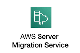

# Connect Kafka to AWS Server Migration Service

Quix helps you integrate Kafka to AWS Server Migration Service using pure Python.

- __Find out how we can help you integrate!__

    <a class="md-button md-button--primary" href="https://share.hsforms.com/1iW0TmZzKQMChk0lxd_tGiw4yjw2?__hstc=175542013.2303933fbd746c0ac86d9ccbe9bc9100.1728383268831.1729603416735.1729620918855.31&__hssc=175542013.1.1729620918855&__hsfp=2132701734" target="_blank" style="margin:.5rem;">Book a demo</a>

## AWS Server Migration Service

The AWS Server Migration Service is a technology developed by Amazon Web Services that simplifies the process of migrating servers to the AWS cloud. This service automates the migration by taking snapshots of on-premises servers and transferring them to Amazon Machine Images (AMIs) in the cloud. It also allows for the continuous replication of live servers, reducing downtime during the migration process. This technology supports both Windows and Linux servers and provides a streamlined, efficient way for businesses to transition their workloads to the cloud. With AWS Server Migration Service, organizations can easily scale their infrastructure, improve resource utilization, and enhance overall business agility.

## Integrations

Quix is a good fit for integrating with AWS Server Migration Service because of its robust features and capabilities that complement the migration process. 

1. Streamlined Development and Deployment: Quix's integrated online code editors and CI/CD tools make it easy to create and deploy data pipelines, which can be beneficial for migrating applications and data to AWS.

2. Real-Time Monitoring: Quix Cloud's tools for real-time logs, metrics, and data exploration can help monitor the migration process and ensure its success.

3. Flexible Scaling and Management: Quix's ability to easily scale resources and manage environments can support the dynamic needs of migrating applications to AWS.

4. Security and Compliance: Quix's secure management of secrets and compliance features align well with AWS's stringent security requirements.

5. Development Tools: Quix's online code editors, templates, and connectors can streamline the migration process and support integration with AWS services.

6. Kafka Integration: Quix's support for Kafka integration can be beneficial for migrating Kafka data streams to AWS.

7. Quix Streams: Quix Streams' cloud-native library for processing data in Kafka using Python can enhance the migration process by providing scalability and a user-friendly interface for working with data.

Overall, Quix's comprehensive platform and features make it a good fit for integrating with AWS Server Migration Service to streamline the migration process and ensure its success.

