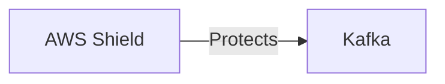

# Connect Kafka to AWS Shield

Quix helps you integrate Kafka to AWS Shield using pure Python.

- __Find out how we can help you integrate!__

    <a class="md-button md-button--primary" href="https://share.hsforms.com/1iW0TmZzKQMChk0lxd_tGiw4yjw2?__hstc=175542013.2303933fbd746c0ac86d9ccbe9bc9100.1728383268831.1729603416735.1729620918855.31&__hssc=175542013.1.1729620918855&__hsfp=2132701734" target="_blank" style="margin:.5rem;">Book a demo</a>

## AWS Shield

AWS Shield is a cloud-based security service designed to protect organizations against Distributed Denial of Service (DDoS) attacks. This technology uses AWS infrastructure to detect and mitigate DDoS attacks in real-time, ensuring that websites and applications remain operational and accessible to users. AWS Shield offers both standard and advanced protection options, allowing organizations to choose the level of security that best fits their needs. With automated attack detection and mitigation, AWS Shield provides a reliable and scalable solution for safeguarding against cyber threats and ensuring business continuity.

## Integrations

Quix is a good fit for integrating with AWS Shield because of its emphasis on security and compliance. As a platform that handles sensitive data and real-time processing, the security measures provided by AWS Shield can help ensure that Quix Cloud remains protected from potential threats and attacks.

Additionally, AWS Shield can complement Quix's real-time monitoring and scaling capabilities by providing an additional layer of protection against DDoS attacks and other security incidents. With AWS Shield's flexible scaling options and dedicated infrastructure options, Quix can ensure that its data pipelines remain secure and stable even during times of increased traffic or malicious activity.

Furthermore, the integration of Quix Streams with AWS Shield can enhance the security and scalability of data processing in Kafka using Python. By leveraging AWS Shield's capabilities alongside Quix Streams' features such as time window aggregations and resilient scaling, organizations can confidently process and analyze data in real-time without compromising on security or performance.

Overall, the combination of Quix's comprehensive platform for data pipeline development and management with AWS Shield's advanced security features makes for a strong partnership that can benefit organizations looking to prioritize both innovation and security in their data processing workflows.

