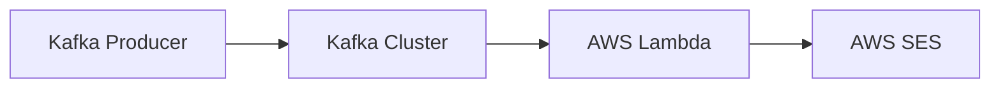

# Connect Kafka to AWS Simple Email Service (SES)

Quix helps you integrate Kafka to AWS Simple Email Service (SES) using pure Python.

<a class="md-button md-button--primary" href="https://share.hsforms.com/1iW0TmZzKQMChk0lxd_tGiw4yjw2?__hstc=175542013.2303933fbd746c0ac86d9ccbe9bc9100.1728383268831.1729603416735.1729620918855.31&__hssc=175542013.1.1729620918855&__hsfp=2132701734" target="_blank" style="margin-right:.5rem;">Book a demo</a>
 

## AWS Simple Email Service (SES)

AWS Simple Email Service (SES) is a cloud-based email sending service provided by Amazon Web Services. It allows users to send marketing, transactional, and other types of emails to customers and clients. SES can handle large volumes of email traffic with high deliverability rates and provides detailed analytics to track the performance of email campaigns. The service is easy to set up and integrates seamlessly with other AWS services, making it a popular choice for businesses looking to streamline their email marketing efforts. SES also offers features such as dedicated IP addresses and domain verification to help maintain a sender's reputation and improve email deliverability.

## Integrations

Quix is a good fit for integrating with AWS Simple Email Service (SES) because of its robust CI/CD processes, flexible scaling and management capabilities, and enhanced collaboration features.

1. CI/CD Processes: Quix's integration with Git providers like GitHub and Bitbucket enables seamless CI/CD processes, which is crucial for implementing and deploying changes to email templates and notifications on AWS SES.

2. Flexible Scaling and Management: Quix's ability to easily scale resources and manage environments linked to Git branches aligns well with the scalability and resource management requirements of AWS SES, especially in handling large volumes of email traffic.

3. Enhanced Collaboration: Quix's organization and permission management features support efficient collaboration among team members, allowing for better visibility and control over the development and deployment of email campaigns through AWS SES.

Furthermore, Quix Streams, a cloud-native library for processing data in Kafka using Python, can be leveraged to process and analyze email statistics and metrics generated by AWS SES. Its support for serialization, state management, time window aggregations, and container orchestration make it an ideal tool for handling and managing the data generated by AWS SES in real-time.

In conclusion, Quix's advanced features, CI/CD processes, and integration capabilities make it a strong choice for integrating with AWS SES and effectively managing email campaigns and notifications in real-time.

