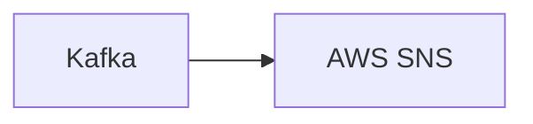

# Connect Kafka to AWS Simple Notification Service (SNS)

Quix helps you integrate Kafka to AWS Simple Notification Service (SNS) using pure Python.

<a class="md-button md-button--primary" href="https://share.hsforms.com/1iW0TmZzKQMChk0lxd_tGiw4yjw2?__hstc=175542013.2303933fbd746c0ac86d9ccbe9bc9100.1728383268831.1729603416735.1729620918855.31&__hssc=175542013.1.1729620918855&__hsfp=2132701734" target="_blank" style="margin-right:.5rem;">Book a demo</a>
 

## AWS Simple Notification Service (SNS)

AWS Simple Notification Service (SNS) is a flexible and fully managed messaging service provided by Amazon Web Services (AWS). It enables applications, services, and devices to send notifications to a large number of subscribers through multiple delivery protocols such as HTTP/HTTPS, Email, SMS, and more. SNS simplifies the task of sending messages to users or systems by decoupling the message publisher from the message subscribers, making it easy to scale and distribute messages to a wide range of recipients. With SNS, developers can create topics to which users can subscribe, and then publish messages to those topics to be delivered to all subscribers. This centralized and efficient communication system helps to streamline messaging workflows and improve the reliability of information delivery across a variety of platforms.

## Integrations

Quix is a good fit for integrating with AWS Simple Notification Service (SNS) because of its robust integration with various data sources and sinks, including Kafka. Since Quix Streams is a cloud-native library designed specifically for processing data in Kafka using Python, it seamlessly integrates with Quix's capabilities for developing, deploying, and managing real-time data pipelines.

By leveraging Quix Streams, users can easily connect their Kafka streams to SNS notifications, enabling them to receive real-time alerts and updates based on data processing events. This integration enhances the capabilities of Quix Cloud by providing a seamless way to incorporate event-driven notifications into data pipelines, enhancing visibility and control over pipeline performance.

Furthermore, Quix's support for flexible scaling and management, real-time monitoring tools, and efficient collaboration features make it well-suited for working with SNS and enabling efficient communication and notifications within data pipelines. The platform's secure management of secrets and compliance with dedicated infrastructure options also ensure that sensitive data handling and notification processes remain secure and compliant.

Overall, the combination of Quix's comprehensive platform features and Quix Streams' capabilities for processing data in Kafka make it an excellent choice for integrating with AWS Simple Notification Service and facilitating seamless communication and alerting within real-time data pipelines.

