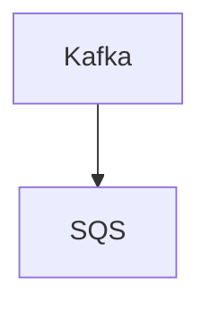

# Connect Kafka to AWS Simple Queue Service (SQS)

Quix helps you integrate Kafka to AWS Simple Queue Service (SQS) using pure Python.

- __Find out how we can help you integrate!__

    <a class="md-button md-button--primary" href="https://share.hsforms.com/1iW0TmZzKQMChk0lxd_tGiw4yjw2?__hstc=175542013.2303933fbd746c0ac86d9ccbe9bc9100.1728383268831.1729603416735.1729620918855.31&__hssc=175542013.1.1729620918855&__hsfp=2132701734" target="_blank" style="margin:.5rem;">Book a demo</a>

## AWS Simple Queue Service (SQS)

AWS Simple Queue Service (SQS) is a fully managed message queuing service provided by Amazon Web Services (AWS). It allows users to decouple and scale microservices, distributed systems, and serverless applications by securely and reliably transferring data between different components. SQS handles the storage, delivery, and processing of messages, which are stored in a queue and can be processed by consumers at their own pace. With SQS, developers can easily integrate message queues into their applications without worrying about infrastructure management, allowing them to focus on building and scaling their applications. Additionally, SQS provides features such as dead-letter queues, message filtering, and message retention periods, making it a versatile and efficient tool for building resilient and scalable systems in the cloud.

## Integrations

Quix is a good fit for integrating with AWS Simple Queue Service (SQS) because it offers a comprehensive platform for developing and managing real-time data pipelines. The key components of Quix, such as streamlined development and deployment, enhanced collaboration, real-time monitoring, and flexible scaling, align well with the capabilities of AWS SQS.

1. Streamlined Development and Deployment: Quix provides integrated online code editors and CI/CD tools, making it easy to create and deploy data pipelines. This aligns with the ease of use and simplicity offered by AWS SQS, allowing for quick integration and deployment of messaging queues.

2. Enhanced Collaboration: Quix supports efficient collaboration with organization and permission management, enhancing visibility and control over projects. This can help teams working with AWS SQS to streamline communication and coordination on queue configurations and messaging workflows.

3. Real-Time Monitoring: Quix Cloud provides tools for real-time logs, metrics, and data exploration, allowing users to monitor pipeline performance. This complements the visibility and monitoring capabilities of AWS SQS, enabling users to track message throughput and queue performance in real-time.

4. Flexible Scaling and Management: Quix allows users to easily scale resources and manage CPU and memory, which can help optimize the utilization of AWS SQS resources. By integrating with Quix, users can efficiently manage multiple environments linked to Git branches, ensuring smooth scaling and resource allocation for messaging queues.

In addition, Quix Streams, the cloud-native library for processing data in Kafka using Python, offers benefits such as seamless Python ecosystem integration, serialization and state management support, time window aggregations, and resilient scaling. This aligns well with the capabilities of AWS SQS, making it a suitable choice for integrating Quix with SQS for efficient and scalable data pipeline development and management.

