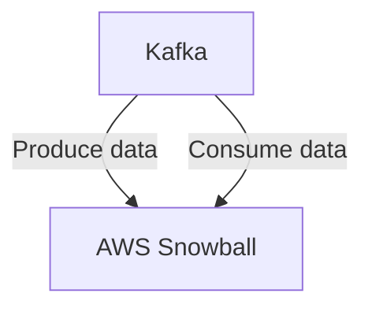

# Connect Kafka to AWS Snowball

Quix helps you integrate Kafka to AWS Snowball using pure Python.

<a class="md-button md-button--primary" href="https://share.hsforms.com/1iW0TmZzKQMChk0lxd_tGiw4yjw2?__hstc=175542013.2303933fbd746c0ac86d9ccbe9bc9100.1728383268831.1729603416735.1729620918855.31&__hssc=175542013.1.1729620918855&__hsfp=2132701734" target="_blank" style="margin-right:.5rem;">Book a demo</a>
 

## AWS Snowball

AWS Snowball is a data transfer device offered by Amazon Web Services that allows users to transfer large amounts of data to and from the cloud in a secure and efficient manner. This rugged, tamper-resistant device is designed to withstand harsh environments and can transfer up to 80 terabytes of data at a time. Users can simply plug in the device, transfer their data, and then ship it back to AWS for uploading to their cloud storage. With AES-256 bit encryption and built-in security features, AWS Snowball ensures that data transfers are safe and protected throughout the entire process. This technology is ideal for organizations that need to migrate large volumes of data quickly and securely.

## Integrations

Quix is a good fit for integrating with AWS Snowball because it offers a comprehensive platform for developing, deploying, and managing real-time data pipelines. With key components such as streamlined development and deployment, enhanced collaboration, real-time monitoring, flexible scaling and management, security and compliance, development tools, and Kafka integration, Quix provides a robust and versatile environment for handling data processing tasks.

Additionally, Quix Streams, a cloud-native library for processing data in Kafka using Python, offers benefits such as no JVM requirement, seamless integration with the Python ecosystem, support for serialization and state management, time window aggregations, resilient scaling, and local and Jupyter Notebook support. This makes it a powerful tool for working with data in a scalable and efficient manner.

When combined with AWS Snowball, which is a data transfer and edge computing device that helps move large amounts of data to and from the cloud, Quix can effectively handle data processing tasks and seamlessly integrate with the AWS Snowball infrastructure. The scalability, flexibility, and reliability of Quix make it a perfect match for leveraging the capabilities of AWS Snowball and efficiently managing data pipelines in real-time.

