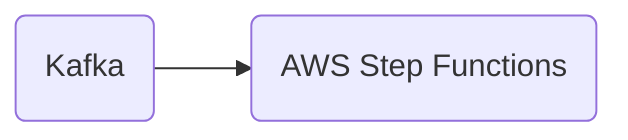

# Connect Kafka to AWS Step Functions

Quix helps you integrate Kafka to AWS Step Functions using pure Python.

- __Find out how we can help you integrate!__

    <a class="md-button md-button--primary" href="https://share.hsforms.com/1iW0TmZzKQMChk0lxd_tGiw4yjw2?__hstc=175542013.2303933fbd746c0ac86d9ccbe9bc9100.1728383268831.1729603416735.1729620918855.31&__hssc=175542013.1.1729620918855&__hsfp=2132701734" target="_blank" style="margin:.5rem;">Book a demo</a>

## AWS Step Functions

AWS Step Functions is a serverless orchestration service offered by Amazon Web Services (AWS) that allows users to easily coordinate the components of distributed applications and microservices through visual workflows. With Step Functions, developers can create complex state machines that define the sequence of steps required to execute various tasks in a workflow. These state machines can integrate with AWS services such as Lambda functions, S3 storage, DynamoDB databases, and more. Step Functions provides robust error handling, retry mechanisms, and logging, making it easier for developers to build resilient and scalable applications. Additionally, the service offers monitoring and visualization tools to track the progress of workflows and troubleshoot any issues that may arise. Overall, AWS Step Functions simplifies the process of orchestrating distributed systems and helps developers build more reliable and efficient applications.

## Integrations

Quix is a good fit for integrating with AWS Step Functions because it offers a comprehensive platform for developing, deploying, and managing real-time data pipelines. The key components of Quix, such as streamlined development and deployment, enhanced collaboration, real-time monitoring, flexible scaling and management, security and compliance, development tools, data exploration and visualization, robust CI/CD processes, and Kafka integration, align well with the capabilities of AWS Step Functions.

Quix's streamlined development and deployment features, including online code editors, CI/CD tools, and YAML synchronization, complement the workflow automation and orchestration provided by AWS Step Functions. This integration can streamline the creation and deployment of data pipelines, making it easier for users to manage and execute complex workflows.

Additionally, Quix's real-time monitoring capabilities and flexible scaling and management options can benefit from AWS Step Functions' ability to orchestrate and coordinate multiple AWS services in a serverless architecture. By integrating with AWS Step Functions, Quix can leverage its scalability and manage resources efficiently to handle varying workloads.

Quix's security and compliance features, such as secure management of secrets and compliance with infrastructure options and SLAs, align with AWS's robust security measures and compliance standards. This integration ensures that data processed through Quix pipelines is secure and compliant with regulations.

Furthermore, Quix's development tools, data exploration and visualization features, and Kafka integration can be enhanced by incorporating AWS Step Functions. The seamless integration of Quix Streams, a cloud-native library for processing data in Kafka using Python, with AWS Step Functions can provide users with a powerful toolset for building and executing data pipelines at scale in a serverless environment.

Overall, the combination of Quix's features and capabilities with AWS Step Functions can enable organizations to develop, deploy, and manage real-time data pipelines with ease, efficiency, and scalability.

