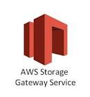
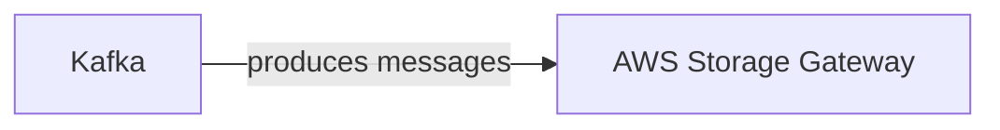

# Connect Kafka to AWS Storage Gateway

Quix helps you integrate Kafka to AWS Storage Gateway using pure Python.

<a class="md-button md-button--primary" href="https://share.hsforms.com/1iW0TmZzKQMChk0lxd_tGiw4yjw2?__hstc=175542013.2303933fbd746c0ac86d9ccbe9bc9100.1728383268831.1729603416735.1729620918855.31&__hssc=175542013.1.1729620918855&__hsfp=2132701734" target="_blank" style="margin-right:.5rem;">Book a demo</a>
 

## AWS Storage Gateway

AWS Storage Gateway is a hybrid cloud storage service that allows organizations to seamlessly integrate on-premises applications with cloud storage services. It acts as a bridge between on-premises storage systems and the cloud, providing a secure and efficient way to extend local storage capacities to the cloud. With AWS Storage Gateway, companies can leverage the scalability and durability of cloud storage while still maintaining low-latency access to their data. It supports various storage protocols such as NFS, SMB, and iSCSI, making it easy for organizations to integrate with their existing infrastructure. Additionally, it offers features like data deduplication, compression, and encryption to ensure data security and optimize storage efficiency. Overall, AWS Storage Gateway provides a flexible and cost-effective solution for seamlessly integrating on-premises and cloud storage environments.

## Integrations

Quix is a good fit for integrating with AWS Storage Gateway due to its comprehensive platform designed for developing, deploying, and managing real-time data pipelines. With key components such as streamlined development and deployment, enhanced collaboration, real-time monitoring, flexible scaling and management, security, and compliance features, Quix provides a robust and scalable solution for handling data pipelines.

Quix Streams, a cloud-native library for processing data in Kafka using Python, further enhances the capabilities of Quix by offering benefits such as no JVM requirement, seamless integration with the Python ecosystem, support for serialization and state management, time window aggregations, resilient scaling, and local and Jupyter Notebook support.

By integrating Quix with AWS Storage Gateway, organizations can leverage Quix's powerful features for developing and managing real-time data pipelines while seamlessly accessing and storing data in AWS Storage Gateway. This integration provides a cohesive solution for efficiently handling data storage and processing tasks in a secure and scalable manner.

