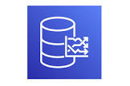

# Connect Kafka to AWS Timestream

Quix helps you integrate Kafka to AWS Timestream using pure Python.

- __Find out how we can help you integrate!__

    <a class="md-button md-button--primary" href="https://share.hsforms.com/1iW0TmZzKQMChk0lxd_tGiw4yjw2?__hstc=175542013.2303933fbd746c0ac86d9ccbe9bc9100.1728383268831.1729603416735.1729620918855.31&__hssc=175542013.1.1729620918855&__hsfp=2132701734" target="_blank" style="margin:.5rem;">Book a demo</a>

## AWS Timestream

AWS Timestream is a fully managed, serverless time-series database that is designed to handle the high volume and high velocity of time-stamped data. It is a scalable and cost-effective solution that allows users to easily store, analyze, and query time-series data at scale. With AWS Timestream, users can ingest data from various sources, such as sensors, IoT devices, and application logs, and then quickly and efficiently query and visualize that data to gain insights and make data-driven decisions. The database is optimized for time-series workloads, with features such as automatic data scaling, automated data retention policies, and built-in analytics functions. Overall, AWS Timestream is a powerful tool for managing time-series data in the cloud.

## Integrations

Quix is a good fit for integrating with AWS Timestream because of its compatibility with Kafka, which is a key component of AWS Timestream's architecture. Quix Streams, a cloud-native library for processing data in Kafka using Python, seamlessly integrates with Kafka and offers a user-friendly Python interface for data processing.

Additionally, Quix offers enhanced collaboration and streamlined development and deployment capabilities, which align with the needs of organizations utilizing AWS Timestream for real-time data processing. The platform's integration with Git providers like GitHub and Bitbucket facilitates seamless CI/CD processes, ensuring efficient development and deployment of data pipelines.

Furthermore, Quix provides tools for real-time monitoring and data exploration, allowing users to monitor pipeline performance and analyze critical metrics in real-time. The platform's flexible scaling and management capabilities, along with dedicated options for running pipelines on specific infrastructure, make it well-suited for handling the demands of AWS Timestream's real-time data processing requirements.

In conclusion, Quix's compatibility with Kafka, streamlined development processes, real-time monitoring capabilities, and flexible scaling options make it a strong fit for integrating with AWS Timestream and enhancing the efficiency and effectiveness of real-time data pipelines.

