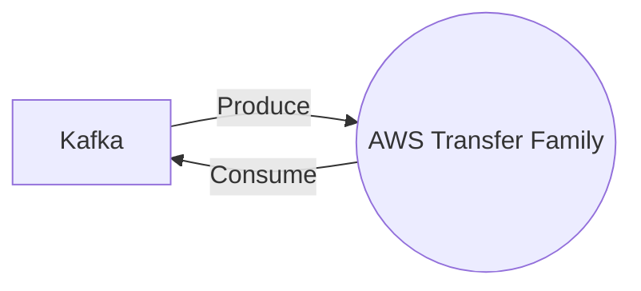

# Connect Kafka to AWS Transfer Family

Quix helps you integrate Kafka to AWS Transfer Family using pure Python.

- __Find out how we can help you integrate!__

    <a class="md-button md-button--primary" href="https://share.hsforms.com/1iW0TmZzKQMChk0lxd_tGiw4yjw2?__hstc=175542013.2303933fbd746c0ac86d9ccbe9bc9100.1728383268831.1729603416735.1729620918855.31&__hssc=175542013.1.1729620918855&__hsfp=2132701734" target="_blank" style="margin:.5rem;">Book a demo</a>

## AWS Transfer Family

AWS Transfer Family is a suite of fully managed services offered by Amazon Web Services that enables organizations to transfer files and data securely over the internet. With AWS Transfer Family, users can easily set up secure file transfer protocols including FTP, FTPS, and SFTP, without the need to manage servers or infrastructure. This technology provides a highly reliable and scalable solution for transferring files, making it an ideal choice for businesses looking to streamline their data transfer processes. Additionally, AWS Transfer Family offers robust security features such as encryption at rest and in transit, as well as integration with AWS Identity and Access Management for fine-grained access control. Overall, AWS Transfer Family simplifies the process of file transfer while ensuring data security and compliance.

## Integrations

Quix is a good fit for integrating with AWS Transfer Family because of its comprehensive platform designed for developing, deploying, and managing real-time data pipelines. The key components of Quix, such as streamlined development and deployment, enhanced collaboration, real-time monitoring, flexible scaling and management, security and compliance, development tools, data exploration and visualization, and robust CI/CD processes, align well with the capabilities of AWS Transfer Family.

Quix Cloud's integration with Git providers like GitHub and Bitbucket for seamless CI/CD processes can be further enhanced by integrating with AWS Transfer Family, which provides fully managed file transfers directly into and out of Amazon S3. The secure management of secrets and compliance offered by Quix Cloud complements the security features of AWS Transfer Family.

Additionally, Quix Streams, a cloud-native library for processing data in Kafka using Python, can benefit from integrating with AWS Transfer Family to enable efficient data transfer between Kafka and other data sources within AWS. The scalability of Quix Streams with Python integration aligns well with the scaling capabilities of AWS Transfer Family, which allows for easy scaling of resources and management of multiple environments.

Overall, the collaboration, real-time monitoring, data exploration, and visualization features of Quix, combined with the scalability and security provided by AWS Transfer Family, make them a good fit for integration to streamline data pipeline development and management workflows.

