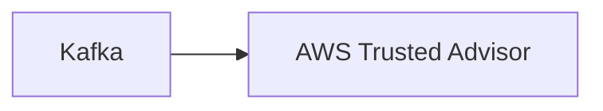

# Connect Kafka to AWS Trusted Advisor

Quix helps you integrate Kafka to AWS Trusted Advisor using pure Python.

<a class="md-button md-button--primary" href="https://share.hsforms.com/1iW0TmZzKQMChk0lxd_tGiw4yjw2?__hstc=175542013.2303933fbd746c0ac86d9ccbe9bc9100.1728383268831.1729603416735.1729620918855.31&__hssc=175542013.1.1729620918855&__hsfp=2132701734" target="_blank" style="margin-right:.5rem;">Book a demo</a>
 

## AWS Trusted Advisor

AWS Trusted Advisor is a cloud service provided by Amazon Web Services that offers users real-time guidance on best practices to help optimize their AWS infrastructure. The technology analyzes users� AWS environment, identifying potential issues and recommending solutions to increase performance, security, and cost-effectiveness. Trusted Advisor provides recommendations in five key areas: cost optimization, performance, security, fault tolerance, and service limits. By utilizing Trusted Advisor, users can improve their AWS usage, reduce costs, and enhance their overall cloud infrastructure efficiency. Overall, AWS Trusted Advisor is a valuable tool for organizations looking to maximize the benefits of their AWS services.

## Integrations

Quix would be a good fit for integrating with AWS Trusted Advisor for several reasons. 

First, Quix Cloud offers real-time monitoring capabilities, which would complement AWS Trusted Advisor's focus on monitoring AWS resources and providing best practice recommendations for optimization. This would allow users to have a comprehensive view of both their data pipelines in Quix and their AWS infrastructure, enabling them to make informed decisions on resource allocation and performance optimization.

Additionally, Quix Cloud's flexible scaling and management features would align well with AWS Trusted Advisor's recommendations on optimizing resource utilization and cost management. By integrating Quix with AWS Trusted Advisor, users would have the ability to easily scale their resources and manage CPU and memory usage based on the recommendations provided by Trusted Advisor.

Moreover, Quix's security and compliance features, such as secure management of secrets and compliance options, would enhance the overall security of the data pipelines and infrastructure managed by AWS Trusted Advisor. This integration would provide users with a comprehensive solution for managing and optimizing both their data pipelines and AWS resources in a secure and compliant manner.

Overall, the integration of Quix with AWS Trusted Advisor would provide users with a powerful combination of real-time monitoring, flexible scaling, and enhanced security and compliance features, enabling them to effectively manage and optimize their data pipelines and AWS infrastructure.

