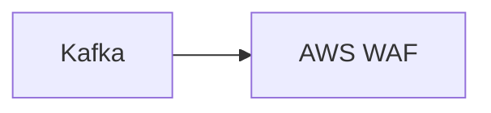

# Connect Kafka to AWS WAF

Quix helps you integrate Kafka to AWS WAF using pure Python.

- __Find out how we can help you integrate!__

    <a class="md-button md-button--primary" href="https://share.hsforms.com/1iW0TmZzKQMChk0lxd_tGiw4yjw2?__hstc=175542013.2303933fbd746c0ac86d9ccbe9bc9100.1728383268831.1729603416735.1729620918855.31&__hssc=175542013.1.1729620918855&__hsfp=2132701734" target="_blank" style="margin:.5rem;">Book a demo</a>

## AWS WAF

AWS WAF, or Amazon Web Services Web Application Firewall, is a web application firewall that helps protect web applications from common web exploits that could affect application availability, compromise security, or consume excessive resources. It allows organizations to create custom rules to block specific traffic patterns or IP addresses that may be malicious or unwanted. AWS WAF integrates seamlessly with other AWS services, such as CloudFront and API Gateway, allowing for easy setup and management. By providing real-time visibility and control over web traffic, AWS WAF helps organizations defend against potential security threats and ensure the availability and performance of their web applications.

## Integrations

Quix is a good fit for integrating with AWS WAF because of its robust security features and compliance measures. As AWS WAF helps protect web applications from common web exploits, Quix Cloud's focus on secure management of secrets and compliance with dedicated infrastructure options aligns well with the security needs of organizations using AWS WAF.

Additionally, Quix's integration with Kafka, including third-party solutions like Confluent Cloud and Redpanda, can provide a seamless connection to data sources and sinks, enabling real-time monitoring and scaling capabilities that are essential for effective security measures. The platform's data exploration and visualization tools also complement the monitoring and management capabilities of AWS WAF, allowing users to effectively track and respond to potential security threats. 

Moreover, Quix Streams' compatibility with Python and integration with libraries like Pandas, scikit-learn, TensorFlow, and PyTorch further enhance its usability and flexibility for organizations looking to integrate with AWS WAF. The combination of data processing capabilities and secure development and deployment tools make Quix a strong candidate for integrating with AWS WAF to ensure enhanced security and compliance for data pipelines.

