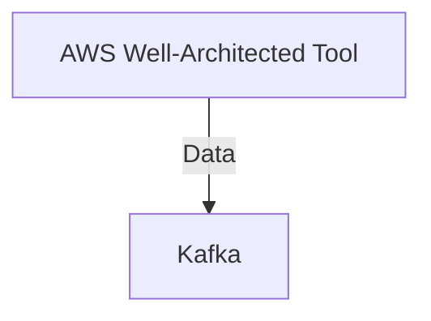

# Connect Kafka to AWS Well-Architected Tool

Quix helps you integrate Kafka to AWS Well-Architected Tool using pure Python.

<a class="md-button md-button--primary" href="https://share.hsforms.com/1iW0TmZzKQMChk0lxd_tGiw4yjw2?__hstc=175542013.2303933fbd746c0ac86d9ccbe9bc9100.1728383268831.1729603416735.1729620918855.31&__hssc=175542013.1.1729620918855&__hsfp=2132701734" target="_blank" style="margin-right:.5rem;">Book a demo</a>
 

## AWS Well-Architected Tool

AWS Well-Architected Tool is a technology developed by Amazon Web Services that helps organizations evaluate their cloud architectures against best practices and design principles. By using this tool, users can assess their cloud workloads in five key areas: operational excellence, security, reliability, performance efficiency, and cost optimization. The tool provides recommendations and guidance for improving these areas, helping organizations ensure their cloud environments are well-designed, secure, and cost-effective. It is a valuable resource for organizations looking to optimize their cloud architectures and achieve better performance and cost savings.

## Integrations

Quix is a good fit for integrating with AWS Well-Architected Tool due to its comprehensive platform designed for developing, deploying, and managing real-time data pipelines. The key components of Quix align well with the pillars of the AWS Well-Architected Framework, which include operational excellence, security, reliability, performance efficiency, and cost optimization.

1. Streamlined Development and Deployment: Quix's integrated online code editors and CI/CD tools simplify the creation and deployment of data pipelines, aligning with best practices for operational excellence. The ability to define pipelines and environment variables as code using YAML synchronization also promotes consistency and reliability.

2. Enhanced Collaboration: The platform supports efficient collaboration with organization and permission management, key elements for ensuring security and fostering collaboration within development teams.

3. Real-Time Monitoring: Quix Cloud's tools for real-time logs, metrics, and data exploration provide visibility into pipeline performance, ensuring that pipelines are meeting performance efficiency and reliability standards.

4. Flexible Scaling and Management: The platform's ability to scale resources, manage CPU and memory, and handle multiple environments linked to Git branches supports cost optimization and performance efficiency. Users can easily adjust resources based on demand, ensuring optimal use of resources.

5. Security and Compliance: Quix Cloud's secure management of secrets and compliance with dedicated infrastructure options align with best practices for ensuring the security and compliance of data pipelines.

6. Development Tools: Quix Cloud's online code editors, code templates, and connectors for various data sources and sinks support streamlined development processes, promoting operational excellence. The platform's integration with DevContainers also enhances workflows and developer efficiency.

7. Data Exploration and Visualization: Quix Cloud's ability to query and explore data in real-time aligns with performance efficiency best practices, allowing users to quickly analyze pipeline data for insights and optimization opportunities.

Overall, Quix's features and capabilities make it a strong fit for integrating with the AWS Well-Architected Tool, as it aligns with best practices for operational excellence, security, reliability, performance efficiency, and cost optimization in developing and managing real-time data pipelines.

