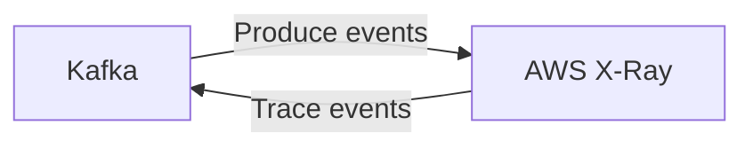

# Connect Kafka to AWS X-Ray

Quix helps you integrate Kafka to AWS X-Ray using pure Python.

<a class="md-button md-button--primary" href="https://share.hsforms.com/1iW0TmZzKQMChk0lxd_tGiw4yjw2?__hstc=175542013.2303933fbd746c0ac86d9ccbe9bc9100.1728383268831.1729603416735.1729620918855.31&__hssc=175542013.1.1729620918855&__hsfp=2132701734" target="_blank" style="margin-right:.5rem;">Book a demo</a>
 

## AWS X-Ray

AWS X-Ray is a powerful technology that allows developers to analyze and debug distributed applications in real-time. By providing a comprehensive view of all the components and services within an application, AWS X-Ray helps developers pinpoint performance issues and troubleshoot errors quickly. With its intuitive interface and detailed insights, developers can easily identify bottlenecks, latency issues, and other potential problems that may be affecting the overall performance of their applications. By utilizing AWS X-Ray, developers can improve application performance, optimize resource usage, and ultimately provide a better user experience for their customers.

## Integrations

Quix is a good fit for integrating with AWS X-Ray because of its emphasis on real-time monitoring and scaling capabilities. AWS X-Ray is a distributed tracing service that allows developers to analyze and debug distributed applications. By integrating Quix with AWS X-Ray, users can gain valuable insights into the performance of their data pipelines in real-time.

With Quix's real-time monitoring tools, users can easily track the performance of their pipelines and identify any bottlenecks or issues. By integrating with AWS X-Ray, users can further enhance their monitoring capabilities and gain a deeper understanding of how their pipelines are performing across different services and components.

Additionally, Quix's flexible scaling and management features make it easy for users to adapt their pipelines to changing workloads. By integrating with AWS X-Ray, users can make use of AWS's powerful scaling capabilities to ensure their pipelines are always running efficiently and effectively.

Overall, the combination of Quix's comprehensive platform for developing and managing data pipelines with AWS X-Ray's distributed tracing capabilities makes for a powerful and effective solution for monitoring and optimizing real-time data pipelines.

