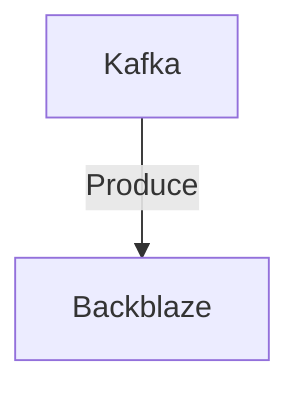

# Connect Kafka to Backblaze

Quix helps you integrate Kafka to Backblaze using pure Python.

## Backblaze

Backblaze is a cloud-based backup service that securely stores and protects all of your computer files, including documents, photos, videos, and more. Users can easily set up automatic backups, ensuring that their data is constantly being saved and protected in the event of hardware failure, theft, or other catastrophes. Backblaze is compatible with both Windows and Mac operating systems, and offers unlimited storage space for a flat monthly fee. Additionally, the service includes features such as file versioning and remote file access, making it a comprehensive and reliable solution for keeping your data safe and accessible at all times.

## Integrations

Quix is a good fit for integrating with Backblaze for several reasons. 

Firstly, Quix Streams provides a cloud-native library for processing data in Kafka using Python, which aligns well with Backblaze's cloud storage services. This makes it easier to seamlessly integrate data pipelines and processes between the two platforms.

Secondly, Quix Cloud offers flexible scaling and management capabilities, allowing users to easily scale resources and manage CPU and memory usage. This is beneficial when working with large amounts of data stored in Backblaze, as it ensures optimal performance and resource utilization.

Additionally, Quix Streams supports serialization and state management, which is important for handling data stored in Backblaze in various formats. This allows for efficient processing and manipulation of data for analysis and insights.

Furthermore, Quix Cloud's real-time monitoring and visualization tools can be leveraged to monitor pipeline performance and critical metrics, providing valuable insights into data stored in Backblaze and enabling users to make informed decisions based on real-time data.

Overall, the combination of Quix with Backblaze provides a powerful and comprehensive solution for developing, deploying, and managing real-time data pipelines, making it a good fit for integrating with Backblaze for efficient and effective data processing and management.

