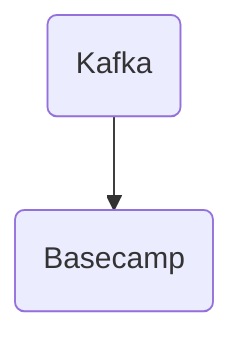

# Connect Kafka to Basecamp

Quix helps you integrate Kafka to Basecamp using pure Python.

## Basecamp

Basecamp is a project management and collaboration tool that allows teams to organize their work, communicate, and track progress in one centralized platform. With features such as to-do lists, file sharing, message boards, and scheduling tools, Basecamp helps teams stay organized and on track with their projects. Users can create projects, assign tasks, and set deadlines to keep everyone on the same page. The platform also offers real-time messaging and automatic check-ins to keep team members connected and informed. Basecamp is designed to streamline communication and improve productivity, making it a valuable tool for businesses and organizations of all sizes.

## Integrations

Integrating Quix with Basecamp provides several benefits for managing and developing real-time data pipelines. 

1. Streamlined Development and Deployment: The integrated online code editors and CI/CD tools in Quix Cloud make it easy to create and deploy data pipelines. This aligns well with Basecamp's emphasis on collaboration and efficiency in project management.

2. Enhanced Collaboration: Quix Cloud's organization and permission management features enhance collaboration and provide increased project visibility and control. This complements Basecamp's focus on communication and teamwork.

3. Real-Time Monitoring: Quix Cloud's real-time monitoring tools allow users to track pipeline performance and critical metrics. This real-time visibility aligns with Basecamp's goal of keeping teams informed and on track.

4. Flexible Scaling and Management: Quix Cloud enables users to easily scale resources and manage multiple environments linked to Git branches. This flexibility aligns with Basecamp's emphasis on adaptability and efficiency in project management.

5. Security and Compliance: Quix Cloud ensures secure management of secrets and compliance with dedicated infrastructure options, providing peace of mind for users integrating with Basecamp.

Overall, Quix Streams and Quix Cloud offer a comprehensive platform for managing real-time data pipelines that complements Basecamp's emphasis on collaboration, efficiency, and project management. The streamlined development and deployment processes, enhanced collaboration features, real-time monitoring capabilities, and flexible scaling options make Quix a good fit for integrating with Basecamp in order to streamline and enhance data pipeline development and management processes.

