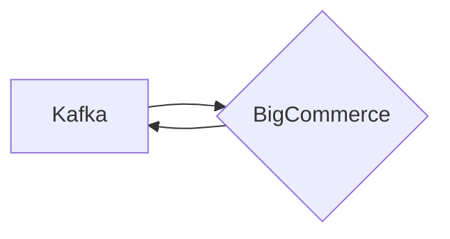

# Connect Kafka to BigCommerce

Quix helps you integrate Kafka to BigCommerce using pure Python.

## BigCommerce

BigCommerce is a powerful e-commerce platform that enables businesses of all sizes to create and manage their online stores with ease. It provides a wide range of features and tools that make selling products online simple and efficient. With BigCommerce, users can easily customize their store layout, manage inventory, process orders, and accept payments securely. The platform also offers advanced marketing and SEO tools to help businesses reach a wider audience and drive more sales. Overall, BigCommerce is a comprehensive e-commerce solution that empowers businesses to build and grow their online presence successfully.

## Integrations

Quix is a good fit for integrating with BigCommerce because of its ability to handle real-time data pipelines efficiently. BigCommerce, being an eCommerce platform, generates and processes a vast amount of data in real time, such as customer transactions, product updates, inventory changes, and more.

With Quix Streams, businesses can easily process and analyze this real-time data generated by BigCommerce using Python, a popular programming language in the data science and analytics community. Quix Streams allows users to scale resources, manage CPU and memory, and handle multiple environments, making it well-suited for handling the dynamic nature of data in eCommerce.

Additionally, the platform's real-time monitoring and logging capabilities provide visibility into the performance of data pipelines, ensuring that any issues are quickly detected and resolved. The integration with Git providers also streamlines the CI/CD processes, enabling seamless deployment and updates to data pipelines connected to BigCommerce.

Furthermore, Quix Streams' support for serialization formats and stateful operations, as well as time window aggregations, can help businesses efficiently process and analyze complex data structures generated by BigCommerce. The platform's resilience and container orchestration capabilities ensure that data pipelines run smoothly and can scale according to the demands of BigCommerce's data processing needs.

Overall, Quix provides the necessary tools and features to integrate with BigCommerce and effectively process, analyze, and manage the real-time data generated by an eCommerce platform.

