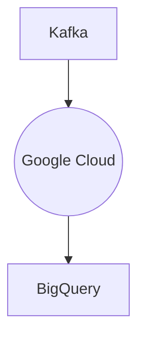

# Connect Kafka to BigQuery

Quix helps you integrate Kafka to BigQuery using pure Python.

## BigQuery

BigQuery is a fully managed and serverless data warehouse provided by Google Cloud. It allows users to run complex queries on large datasets quickly and cost-effectively. BigQuery utilizes a distributed architecture to process data in parallel, making it ideal for analyzing and deriving insights from massive amounts of data in real-time. Users can import data from various sources, including Google Cloud Storage, Google Drive, and Bigtable, and then easily manipulate and analyze it using standard SQL queries. With its scalability, flexibility, and powerful analytics capabilities, BigQuery is a popular choice for businesses looking to unlock the potential of their data.

## Integrations

Quix is a good fit for integrating with BigQuery because of the following reasons:

1. Streamlined Development and Deployment: Quix Cloud's streamlined development and deployment features can help in efficiently creating and deploying data pipelines that interact with BigQuery, simplifying the process of extracting and loading data into BigQuery for analysis.

2. Real-Time Monitoring: Quix Cloud's real-time monitoring tools can be beneficial for tracking pipeline performance and critical metrics when integrating with BigQuery, ensuring that data is being processed and loaded in a timely manner.

3. Data Exploration and Visualization: Quix Cloud's data exploration and visualization capabilities can be useful for querying and exploring data stored in BigQuery, making it easier to analyze and visualize the data being processed by the pipelines.

4. Kafka Integration: Quix Cloud's integration with Kafka can be advantageous for ingesting and processing data streams from Kafka before loading them into BigQuery, providing a seamless pipeline for real-time data processing.

5. Python Ecosystem Integration: Quix Streams' integration with the Python ecosystem can be beneficial for developers who prefer using Python for data processing tasks, allowing them to easily interact with BigQuery using Python scripts within the Quix Streams environment.

Overall, the features and capabilities of Quix align well with the requirements for integrating with BigQuery, making them a suitable choice for building and managing real-time data pipelines that interact with BigQuery.

