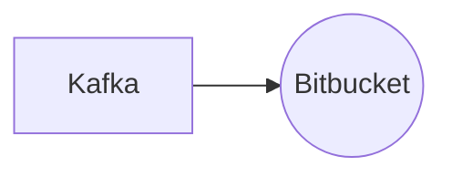

# Connect Kafka to Bitbucket

Quix helps you integrate Kafka to Bitbucket using pure Python.

## Bitbucket

Bitbucket is a popular web-based platform used for hosting and collaborating on code repositories. It is a version control system that allows developers to easily manage and track changes to their code, enabling multiple team members to work on projects simultaneously. Bitbucket supports both Git and Mercurial repositories, providing flexibility for different workflows. Developers can create branches, pull requests, and merge changes seamlessly, ensuring a smooth and efficient coding process. Additionally, Bitbucket offers features such as code reviews, issue tracking, and integration with various tools like Jira and Slack, making it a comprehensive solution for software development teams. With its robust functionality and user-friendly interface, Bitbucket has become a go-to platform for many organizations looking to streamline their code collaboration process.

## Integrations

Quix is a good fit for integrating with Bitbucket because it provides a streamlined development and deployment process integrated with online code editors and CI/CD tools. This allows developers to easily create and deploy data pipelines while synchronizing pipelines and environment variables as code using YAML.

Additionally, Quix Cloud enhances collaboration through organization and permission management, increasing project visibility and control. This is crucial for teams working on projects stored on Bitbucket, as it ensures that everyone has access to the necessary resources and tools.

Furthermore, Quix Cloud offers real-time monitoring capabilities, allowing users to monitor pipeline performance and critical metrics. This is essential for teams using Bitbucket to keep track of their data pipelines and ensure they are running smoothly.

Quix Cloud's flexible scaling and management features also make it well-suited for integration with Bitbucket, as it allows users to easily scale resources, manage CPU and memory, and handle multiple environments linked to Git branches. This ensures that teams working with Bitbucket can efficiently manage their resources and scale as needed.

Overall, the collaboration, monitoring, scaling, and development tools provided by Quix Streams and Quix Cloud make them a great fit for integrating with Bitbucket, as they complement and enhance the capabilities of the platform for developing, deploying, and managing real-time data pipelines.

