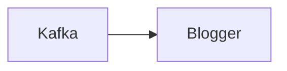

# Connect Kafka to Blogger

Quix helps you integrate Kafka to Blogger using pure Python.

## Blogger

Blogger is a free web-based platform that allows users to create and maintain their own blog sites. Launched by Pyra Labs in 1999 and later acquired by Google in 2003, Blogger provides an easy-to-use interface for creating and publishing content online. Users can customize the design of their blog with various templates and themes, and easily add text, images, and multimedia content to their posts. Blogger also offers tools for organizing and managing blog content, as well as options for monetization through advertisements. With its user-friendly features and wide range of customization options, Blogger has become a popular choice for both casual bloggers and professional content creators looking to share their ideas and experiences with a larger audience.

## Integrations

Quix is a good fit for integrating with the technology called Blogger because it provides a comprehensive platform for developing, deploying, and managing real-time data pipelines. With features such as streamlined development and deployment, enhanced collaboration, real-time monitoring, and flexible scaling and management, Quix Streams/Quix Cloud can help streamline the integration process with Blogger.

The platform's support for efficient collaboration with organization and permission management can enhance project visibility and control, making it easier for multiple team members to work together on integrating Blogger with Quix Streams/Quix Cloud. The real-time monitoring tools provided by Quix Cloud can also help monitor the performance of the data pipelines connecting Blogger with other systems, ensuring smooth operation and timely troubleshooting.

Additionally, the flexible scaling and management capabilities of Quix Streams/Quix Cloud make it easy to adjust resources, manage CPU and memory usage, and handle multiple environments linked to Git branches, providing the scalability needed to support the integration with Blogger. The platform's security and compliance features also ensure that sensitive data is handled securely and that any regulatory requirements are met during the integration process.

In summary, Quix is a good fit for integrating with Blogger due to its comprehensive set of features designed to streamline development, enhance collaboration, provide real-time monitoring, and offer flexible scaling and management capabilities. These features make it easier to successfully integrate Blogger with other systems using Quix Streams/Quix Cloud.

