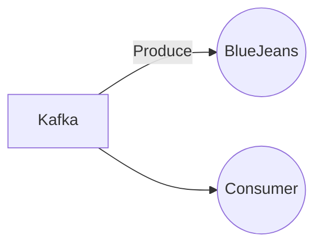

# Connect Kafka to BlueJeans

Quix helps you integrate Kafka to BlueJeans using pure Python.

## BlueJeans

BlueJeans is a cutting-edge video conferencing platform that allows individuals and teams to easily connect and collaborate from anywhere in the world. With its intuitive interface and high-definition video and audio quality, BlueJeans provides a seamless and immersive virtual meeting experience. Users can join meetings from their desktop, laptop, smartphone, or tablet, making it convenient for people on the go. Additionally, BlueJeans offers features such as screen sharing, recording capabilities, and integration with popular productivity tools like Microsoft Teams and Slack. Overall, BlueJeans is a versatile and reliable technology solution for businesses and organizations looking to streamline their communication and collaboration efforts.

## Integrations

Quix is a good fit for integrating with the technology called BlueJeans because it provides a comprehensive platform for developing, deploying, and managing real-time data pipelines. BlueJeans, as a video conferencing platform, generates a significant amount of data that needs to be efficiently managed and processed in real time. Quix Streams can seamlessly process and analyze this data in Kafka using Python, without the need for a server-side engine or orchestrator.

Furthermore, Quix Streams offers serialization and state management capabilities, time window aggregations, and resilient scaling through container orchestration � all of which are essential for handling large volumes of real-time data generated by BlueJeans. The integration with Quix Cloud also ensures secure management of secrets and compliance with dedicated infrastructure options, providing a reliable and scalable solution for handling and processing data from BlueJeans.

In addition, the platform's support for collaboration, real-time monitoring, and visualization tools will enable BlueJeans users to efficiently analyze and derive insights from their data. The integration with DevContainers and Git providers also enhances the CI/CD processes, facilitating seamless development and deployment of data pipelines.

Overall, Quix's capabilities align well with the requirements for integrating with BlueJeans, offering a robust and scalable solution for processing, analyzing, and managing real-time data generated by the video conferencing platform.

