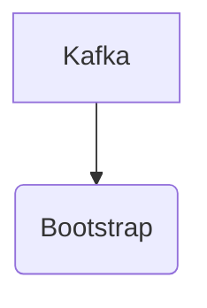

# Connect Kafka to Bootstrap

Quix helps you integrate Kafka to Bootstrap using pure Python.

## Bootstrap

Bootstrap is a front-end development framework that allows developers to create responsive and mobile-first websites and web applications quickly and efficiently. Developed by Twitter, Bootstrap is an open-source technology that includes templates, CSS and JavaScript components, and a grid system that enables users to build a visually appealing and user-friendly interface. With Bootstrap, developers can easily customize the look and feel of their projects, as well as ensure they are compatible with various devices and screen sizes. This technology has gained popularity among developers due to its ease of use and flexibility, making it a valuable tool for creating modern and professional websites.

## Integrations

Quix is a good fit for integrating with Bootstrap because Bootstrap is a front-end framework that provides a responsive and mobile-first design for web development. By integrating Quix with Bootstrap, developers can create visually appealing and user-friendly interfaces for real-time data pipelines developed on the platform.

Bootstrap offers a wide range of pre-designed components, such as buttons, navigation bars, and forms, that can be easily customized and integrated into Quix's data pipeline applications. This can help streamlining the development process and enhance the overall user experience of the pipelines.

Additionally, Bootstrap's grid system allows for easy layout and alignment of elements on the web pages, ensuring that the data visualization and exploration features of Quix can be presented in a clear and organized manner. This can be particularly useful for displaying real-time metrics and logs to users monitoring the performance of their pipelines.

Overall, by integrating with Bootstrap, Quix can benefit from a modern and responsive design framework that enhances the usability and aesthetics of the data pipeline applications developed on the platform. This can ultimately improve user engagement and satisfaction with the real-time data processing capabilities provided by Quix.

