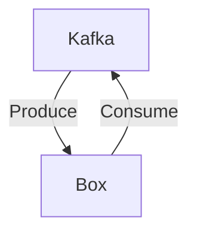

# Connect Kafka to Box

Quix helps you integrate Kafka to Box using pure Python.

## Box

Box is a cloud-based content management and collaboration platform that allows users to securely store, organize, and share files and data online. With features such as file syncing, file access permissions, and version control, Box enables teams to work together on projects from different locations and devices. Box also offers integrations with various third-party tools, allowing users to streamline their workflows and increase productivity. Additionally, Box prioritizes data security, with options for encryption, data loss prevention, and compliance with various industry regulations. Overall, Box is a versatile and user-friendly technology that helps organizations manage their digital content effectively.

## Integrations

Quix is a good fit for integrating with Box because it offers a comprehensive platform for developing, deploying, and managing real-time data pipelines. Box is a cloud content management and file sharing service that is often used by organizations to store and manage their files and collaborate on projects. By integrating Quix with Box, users can easily ingest, process, and analyze data stored in Box, allowing for seamless integration and collaboration between the two platforms.

Quix Cloud's features such as streamlined development and deployment, enhanced collaboration, real-time monitoring, and flexible scaling and management make it well-suited for integrating with Box. By using Quix Cloud's integrated online code editors and CI/CD tools, users can easily create and deploy data pipelines that interact with Box data. The platform's real-time monitoring capabilities also allow users to track the performance of their pipelines and ensure that critical metrics are being met.

Additionally, Quix Cloud's support for security and compliance, data exploration and visualization, and robust CI/CD processes ensure that data stored in Box is handled securely and efficiently. With features like dedicated infrastructure options, integration with Git providers, and support for Kafka, Quix Cloud provides a flexible and reliable platform for integrating with Box and processing data in real-time.

Furthermore, Quix Streams' cloud-native library for processing data in Kafka using Python further enhances the integration with Box by offering scalability and a user-friendly Python interface. With benefits such as no JVM requirement, Python ecosystem integration, serialization and state management support, and resilient scaling, Quix Streams makes it easy to work with Kafka data and seamlessly integrate with Box for efficient data processing and analysis.

Overall, the combination of Quix with Box provides a powerful solution for organizations looking to manage and analyze their data stored in Box, enabling them to leverage real-time data pipelines and streamline their data processing workflows.

