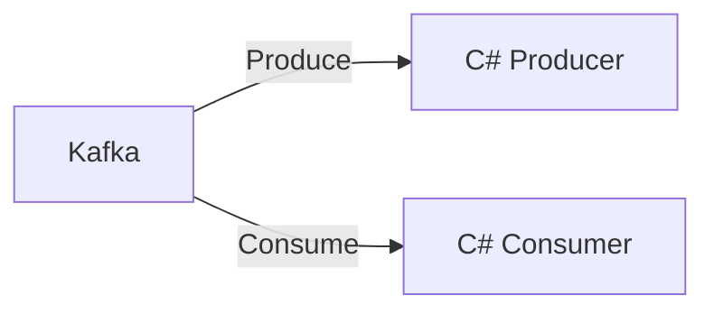

# Connect Kafka to C#

Quix helps you integrate Kafka to C# using pure Python.

## C#

C# is a versatile and highly popular programming language developed by Microsoft. It is part of the .NET framework and is used for building a wide range of applications, from desktop to web to mobile. C# is known for its simplicity, efficiency, and scalability, making it a great choice for developers looking to create robust and high-performance software. It features strong typing, automatic memory management, and modern language constructs, which make it easy to learn and use. C# is also supported by a large and active community, providing plenty of resources and support for developers. Overall, C# is a powerful and reliable technology that is widely used in the software industry for creating innovative and impactful applications.

## Integrations

Quix is a good fit for integrating with C# technology because it provides a comprehensive platform for developing, deploying, and managing real-time data pipelines. The platform offers streamlined development and deployment capabilities, enhanced collaboration tools, real-time monitoring features, and flexible scaling options, all of which are essential for integrating with C# applications.

Additionally, Quix Cloud supports secure management of secrets and compliance with dedicated infrastructure options, ensuring that data processed through the pipelines is kept secure and compliant. The platform also includes development tools such as online code editors, code templates, and connectors for various data sources and sinks, which can be beneficial for C# developers working on data processing tasks.

Moreover, Quix Streams, which is a cloud-native library for processing data in Kafka using Python, can also be integrated with C# applications. With its support for serialization formats, time window aggregations, and resilient scaling, Quix Streams can complement the capabilities of C# technology and provide additional tools for processing data efficiently.

Overall, both Quix Streams and Quix Cloud offer a range of features that can enhance the development and management of real-time data pipelines, making them a good fit for integrating with C# technology.

