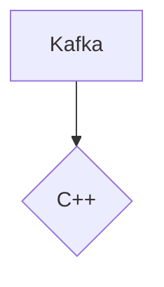

# Connect Kafka to C++

Quix helps you integrate Kafka to C++ using pure Python.

## C++

C++ is a widely-used, high-level programming language developed by Bjarne Stroustrup in 1979. It is an extension of the C programming language and is known for its efficiency, flexibility, and performance. C++ allows developers to create complex programs and applications by utilizing object-oriented programming principles such as classes, inheritance, and polymorphism. It is commonly used in the development of system software, device drivers, video games, and other performance-intensive applications. C++ is a versatile language that is both powerful and complex, making it a preferred choice for many professional software developers.

## Integrations

Quix would be a good fit for integrating with C++ technology because it offers a comprehensive platform for developing, deploying, and managing real-time data pipelines. 

1. Streamlined Development and Deployment: Quix Cloud provides integrated online code editors and CI/CD tools, which can be beneficial for C++ developers to simplify the creation and deployment of data pipelines.

2. Enhanced Collaboration: The platform supports efficient collaboration with organization and permission management, allowing C++ developers to work effectively in teams and increase project visibility and control.

3. Real-Time Monitoring: Quix Cloud offers tools for real-time logs, metrics, and data exploration, enabling C++ developers to monitor pipeline performance and critical metrics in real-time.

4. Flexible Scaling and Management: C++ developers can easily scale resources, manage CPU and memory, and handle multiple environments linked to Git branches using Quix Cloud.

5. Security and Compliance: Quix Cloud ensures secure management of secrets and compliance with dedicated infrastructure options and SLAs, providing a secure environment for C++ developers to work.

In addition, Quix Streams, a cloud-native library for processing data in Kafka using Python, can also be beneficial for integrating with C++. It offers features such as serialization and state management, time window aggregations, and resilient scaling, which can complement the capabilities of C++ technology and enhance data processing and analysis pipelines. Moreover, the integration with Kafka and support for Python ecosystem integration make Quix Streams a versatile tool for developers working with C++ technology in real-time data processing scenarios.

