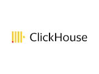

# Connect Kafka to ClickHouse

Quix helps you integrate Kafka to ClickHouse using pure Python.

- __Find out how we can help you integrate!__

    <a class="md-button md-button--primary" href="https://share.hsforms.com/1iW0TmZzKQMChk0lxd_tGiw4yjw2?__hstc=175542013.2303933fbd746c0ac86d9ccbe9bc9100.1728383268831.1729603416735.1729620918855.31&__hssc=175542013.1.1729620918855&__hsfp=2132701734" target="_blank" style="margin:.5rem;">Book a demo</a>

## ClickHouse

ClickHouse is an open-source, column-oriented database management system that is specifically designed for high-performance analytics and data processing. Developed by Yandex, ClickHouse offers lightning-fast query capabilities, allowing users to run complex analytical queries on vast amounts of data in near real-time. Its columnar storage structure enables efficient data compression, reducing storage requirements and improving performance. ClickHouse also supports a wide range of data sources and data formats, making it a flexible and versatile tool for handling diverse data sets. Overall, ClickHouse is a powerful technology that can significantly accelerate data analysis and decision-making processes for organizations dealing with large volumes of data.

## Integrations

Quix is a good fit for integrating with ClickHouse because of the following reasons:

1. Streamlined Development and Deployment: Quix Cloud's integrated online code editors and CI/CD tools make it easy to create and deploy data pipelines. This aligns well with ClickHouse's focus on high-performance data processing and analytics.

2. Real-Time Monitoring: Quix Cloud's real-time monitoring tools allow users to closely monitor the performance of data pipelines, which is essential when working with ClickHouse's real-time data processing capabilities.

3. Enhanced Collaboration: Quix Cloud's collaboration features, such as organization and permission management, help teams work together efficiently when integrating ClickHouse into their data workflows.

4. Flexible Scaling and Management: Quix Cloud makes it easy to scale resources and manage multiple environments, which is crucial for handling the large volumes of data that ClickHouse is designed to process.

5. Security and Compliance: Quix Cloud's secure management of secrets and compliance features ensure that data processed by ClickHouse remains protected.

6. Development Tools: Quix Cloud's online code editors and connectors for various data sources align well with ClickHouse's focus on providing powerful tools for data analysis and visualization.

Overall, the comprehensive features of Quix Cloud make it a great fit for integrating with ClickHouse, providing developers with the tools they need to efficiently work with real-time data pipelines and scale their data processing capabilities. Additionally, Quix Streams' cloud-native library for processing data in Kafka using Python complements ClickHouse's capabilities, allowing for seamless integration and enhanced data processing workflows.

