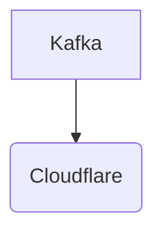

# Connect Kafka to Cloudflare

Quix helps you integrate Kafka to Cloudflare using pure Python.

<a class="md-button md-button--primary" href="https://share.hsforms.com/1iW0TmZzKQMChk0lxd_tGiw4yjw2?__hstc=175542013.2303933fbd746c0ac86d9ccbe9bc9100.1728383268831.1729603416735.1729620918855.31&__hssc=175542013.1.1729620918855&__hsfp=2132701734" target="_blank" style="margin-right:.5rem;">Book a demo</a>
 

## Cloudflare

Cloudflare is a web security and performance company that provides content delivery network (CDN) services, DDoS mitigation, and internet security. It acts as a middleman between website visitors and the website's hosting server, helping to optimize the performance and protect against a range of online threats. By routing website traffic through their global network of servers, Cloudflare is able to provide faster load times, reduce bandwidth usage, and protect websites from malicious attacks such as DDoS attacks, SQL injection, and cross-site scripting. With its easy-to-use interface and powerful features, Cloudflare is a popular choice for businesses looking to improve their website's security and performance.

## Integrations

Quix is a good fit for integrating with Cloudflare because it offers a comprehensive platform for developing, deploying, and managing real-time data pipelines. Cloudflare, on the other hand, is a global content delivery network that provides security, performance, and reliability for websites and applications.

By integrating Quix with Cloudflare, organizations can leverage the streamlined development and deployment features of Quix to create and deploy data pipelines efficiently. The enhanced collaboration capabilities of Quix can also help teams work together more effectively, improving project visibility and control.

Furthermore, the real-time monitoring and scaling capabilities of Quix can complement Cloudflare's performance and security features, providing users with tools to monitor pipeline performance, scale resources easily, and manage CPU and memory efficiently.

Additionally, Quix's integration with Git providers like GitHub and Bitbucket facilitates seamless CI/CD processes, aligning well with Cloudflare's focus on security and compliance.

In terms of Quix Streams, its cloud-native library for processing data in Kafka using Python can further enhance data processing capabilities when integrated with Cloudflare, allowing organizations to leverage Kafka's scalability with a user-friendly Python interface.

Overall, the combination of Quix's features for developing and managing data pipelines, along with its integration with Kafka and support for Python, makes it a suitable technology to integrate with Cloudflare for organizations looking to enhance their data processing and management capabilities.

