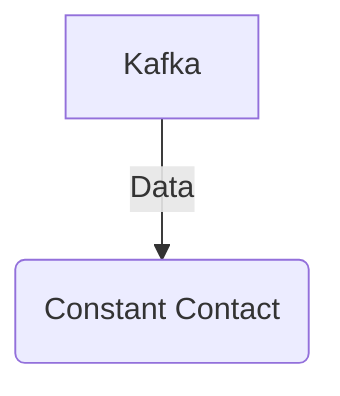

# Connect Kafka to Constant Contact

Quix helps you integrate Kafka to Constant Contact using pure Python.

## Constant Contact

Constant Contact is a powerful email marketing platform that enables businesses to easily create, send, and track email campaigns. This technology allows users to design professional-looking emails with customizable templates and easily manage their contact lists for targeted outreach. With features like automated email campaigns, A/B testing, and detailed analytics, Constant Contact helps businesses engage with their audience and drive conversions. Constant Contact also offers integration with other marketing tools and platforms, making it a comprehensive solution for organizations looking to enhance their digital marketing efforts. Overall, Constant Contact empowers businesses to streamline their email marketing strategies and achieve measurable results.

## Integrations

Constant Contact is a popular email marketing platform that allows businesses to create and send newsletters, marketing emails, and automated campaigns to their customers. Integrating Quix with Constant Contact can bring several benefits:

1. Real-Time Data Processing: Quix Streams can process data in real-time, allowing businesses to analyze customer behavior and engagement as it happens. This can help them personalize their email campaigns and target their audience more effectively.

2. Enhanced Collaboration: Quix Cloud's collaboration features can facilitate teamwork and coordination among marketing teams working on Constant Contact campaigns. This can lead to improved efficiency and better results.

3. Scalability: Both Quix Streams and Quix Cloud are designed for scaling resources as needed, making it easier to handle large amounts of data from Constant Contact and ensure reliable performance.

4. Security and Compliance: With dedicated infrastructure options and secure management of secrets, Quix Cloud can ensure that sensitive customer data handled in Constant Contact campaigns remains secure and compliant with regulations.

5. Data Exploration and Visualization: Quix Cloud provides tools for querying and visualizing data, which can help businesses gain insights from their Constant Contact campaigns and make data-driven decisions.

Overall, integrating Quix with Constant Contact can streamline the process of analyzing and utilizing marketing data, leading to more targeted and successful email campaigns.

