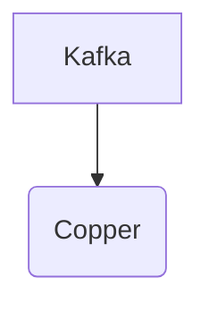

# Connect Kafka to Copper

Quix helps you integrate Kafka to Copper using pure Python.

## Copper

Copper is a technology that revolutionizes how we think about connectivity. Developed by Hologram, Copper is a unique wireless networking solution that offers unparalleled reliability, security, and reach. By combining the power of cellular networks with advanced software-defined networking techniques, Copper is able to provide organizations with a seamless, scalable, and flexible way to connect their devices and applications anywhere in the world. With its ability to automatically switch between different carriers and technologies, Copper ensures maximum uptime and performance, making it an ideal choice for mission-critical IoT deployments. In addition, Copper's built-in encryption and end-to-end security measures protect data transmissions and ensure privacy.Overall, Copper is a game-changing technology that empowers businesses to connect and innovate like never before.

## Integrations

Copper is a customer relationship management (CRM) system that helps businesses manage leads, contacts, and customer interactions. Integrating Quix with Copper can provide several benefits for organizations.

1. Real-time Data Processing: Quix Streams and Quix Cloud are designed for developing, deploying, and managing real-time data pipelines. This means that organizations can process and analyze data from Copper in real-time, allowing for timely insights and actions based on customer interactions.

2. Enhanced Collaboration and Monitoring: Quix Cloud offers features for enhanced collaboration and real-time monitoring of data pipelines. This can help teams working with Copper data to work more efficiently, track performance metrics, and quickly identify and resolve any issues that may arise.

3. Flexible Scaling: Quix Streams and Quix Cloud provide flexible scaling options, allowing organizations to easily scale resources based on the volume of data coming from Copper. This ensures that processing capabilities can adapt to changing business needs without downtime or performance issues.

4. Security and Compliance: Quix Cloud ensures secure management of secrets and compliance with dedicated infrastructure options, which can be crucial for organizations handling sensitive customer data through Copper. This helps maintain data privacy and security standards.

5. Easy Integration with Python Ecosystem: Quix Streams, which is a cloud-native library for processing data in Kafka using Python, can seamlessly integrate with Copper data. This allows organizations to leverage the power of Python libraries for data analysis and machine learning, enhancing the value extracted from Copper data.

Overall, integrating Quix with Copper can streamline data processing, enhance collaboration, provide real-time monitoring, and ensure secure and compliant handling of customer data, making it a good fit for organizations looking to leverage their CRM data for actionable insights and improved customer relations.

