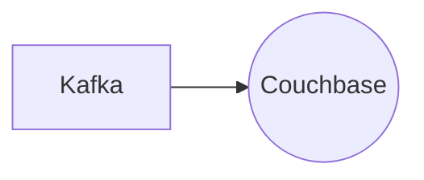

# Connect Kafka to Couchbase

Quix helps you integrate Kafka to Couchbase using pure Python.

## Couchbase

Couchbase is a NoSQL database technology that is designed to handle large amounts of data across multiple servers. It is known for its high performance, scalability, and availability, making it well-suited for large and complex applications that require fast access to data. Couchbase uses a distributed architecture that allows data to be stored and accessed efficiently, with features like caching, indexing, and querying capabilities. It also offers support for a variety of programming languages and frameworks, making it versatile and easy to integrate into existing systems. Overall, Couchbase is a powerful and flexible technology that is ideal for businesses and organizations looking to manage and analyze large volumes of data in real-time.

## Integrations

Couchbase is a NoSQL database that is known for its high performance, scalability, and flexibility. By integrating Quix with Couchbase, users can leverage the benefits of both technologies to create powerful real-time data pipelines. 

One of the key advantages of using Quix with Couchbase is the ability to process and analyze data from Couchbase in real-time. Quix Streams, with its Python-based interface, can easily connect to Couchbase and perform various operations on the data stored in the database. This allows users to process and transform data as it is being ingested into Couchbase, enabling real-time analytics and insights. 

Additionally, the scalability and resilience of Quix Streams make it a good fit for handling large volumes of data from Couchbase. Quix Streams is designed to run and scale via container orchestration, such as Kubernetes, ensuring that it can handle the high throughput of data coming from Couchbase without any performance issues. 

Moreover, the integration of Quix with Couchbase provides users with the flexibility to work with different serialization formats and stateful operations using RocksDB. This allows for efficient data processing and management, enhancing the overall performance of the real-time data pipelines. 

Overall, the compatibility and complementary features of Quix and Couchbase make them a good fit for integrating and building robust real-time data pipelines for a wide range of use cases.

