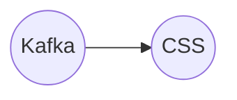

# Connect Kafka to CSS

Quix helps you integrate Kafka to CSS using pure Python.

## CSS

Cascading Style Sheets, more commonly known as CSS, is a technology used in web development to control the visual presentation of a website. CSS allows web designers to separate the structure of a webpage from its appearance, making it easier to make changes to the design without affecting the underlying code. With CSS, designers can specify the layout, colors, fonts, and other design elements of a website, creating a consistent and professional look across all pages. CSS is essential in creating responsive and mobile-friendly websites, as it allows for flexible and dynamic layouts that adapt to different screen sizes and devices. Overall, CSS plays a crucial role in enhancing the user experience and improving the aesthetics of websites on the internet.

## Integrations

Quix is a good fit for integrating with CSS technology because of its comprehensive platform designed for developing, deploying, and managing real-time data pipelines. With its streamlined development and deployment features, developers can easily create and deploy data pipelines using CSS. The enhanced collaboration tools in Quix Cloud also make it easier for teams working with CSS to collaborate effectively and efficiently. Real-time monitoring capabilities in Quix Cloud allow users to monitor CSS pipeline performance and critical metrics in real-time.

Additionally, the flexible scaling and management options in Quix Cloud make it easy to scale resources and manage CPU and memory, making it well-suited for handling the demands of CSS technology. The security and compliance features in Quix Cloud ensure secure management of secrets and compliance with regulations, providing a reliable and secure environment for integrating with CSS.

Furthermore, the development tools, data exploration and visualization capabilities, robust CI/CD processes, and Kafka integration in Quix Cloud provide additional support for integrating with CSS technology. Overall, Quix offers a range of features that make it a good fit for integrating with CSS technology, providing a seamless and efficient solution for developing, deploying, and managing data pipelines in real-time.

