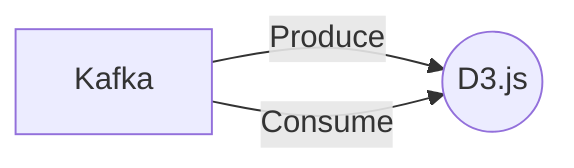

# Connect Kafka to D3.js

Quix helps you integrate Kafka to D3.js using pure Python.

## D3.js

D3.js is a powerful and popular JavaScript library used for creating data visualizations on the web. With its flexible and versatile features, D3.js allows users to bind data to elements in the Document Object Model (DOM) and manipulate those elements using data-driven techniques. This allows for the creation of interactive and dynamic visualizations such as charts, graphs, maps, and more. D3.js also provides a wide range of tools and utilities for working with data, including scales, axes, and transitions. Overall, D3.js is a valuable tool for designers and developers looking to create engaging and informative data visualizations on the web.

## Integrations

Quix is a good fit for integrating with D3.js due to its real-time data processing capabilities and robust development tools. D3.js is a JavaScript library commonly used for data visualization on the web, allowing users to create interactive and dynamic visualizations of data.

With Quix's ability to process and manage real-time data pipelines, users can easily feed data processed with Quix Streams into D3.js for visualization purposes. The platform's streamlined development and deployment tools make it easy to create and deploy data pipelines, while its data exploration and visualization features allow users to easily query and explore data before feeding it into D3.js.

Additionally, Quix Streams' integration with Kafka provides a scalable and reliable way to capture and process streaming data, which can then be visualized using D3.js. The platform's support for serialization formats, state management, and time window aggregations further enhances its compatibility with D3.js, as these features are useful for preparing data for visualization.

Overall, Quix's real-time data processing capabilities, development tools, and support for Kafka make it a good fit for integrating with D3.js for creating dynamic and interactive data visualizations.

