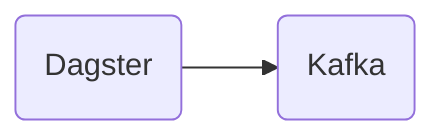

# Connect Kafka to Dagster

Quix helps you integrate Kafka to Dagster using pure Python.

## Dagster

Dagster is a data orchestrator tool that allows users to define and run data pipelines with ease. It provides a unified interface for creating, scheduling, and monitoring complex workflows, making it simple to manage data processing tasks. With Dagster, users can easily define dependencies between tasks, track data quality issues, and scale their pipelines as needed. This technology is designed to streamline the data engineering process and foster collaboration across teams, making it an essential tool for organizations handling large amounts of data.

## Integrations

Quix Streams and Quix Cloud are both excellent options for integrating with Dagster due to their comprehensive features that align well with the capabilities and requirements of real-time data pipelines.

1. Quix Cloud's streamlined development and deployment features, including integrated code editors and CI/CD tools, make it easy to develop and deploy data pipelines in a collaborative environment. This aligns seamlessly with Dagster's focus on data pipeline orchestration and execution.

2. Enhanced collaboration capabilities in Quix Cloud, such as organization and permission management, align well with Dagster's emphasis on collaborative development and deployment of data pipelines.

3. The real-time monitoring tools provided by Quix Cloud are essential for monitoring pipeline performance, analyzing critical metrics, and ensuring the reliability of data pipelines. This aligns with Dagster's focus on observability and monitoring of data pipelines.

4. Quix Cloud's flexible scaling and resource management features make it easy to scale resources, manage CPU and memory, and handle multiple environments linked to Git branches. This aligns well with Dagster's support for scaling data pipelines and managing resources efficiently.

5. The security and compliance features of Quix Cloud ensure secure management of secrets and compliance with dedicated infrastructure options and SLAs. This aligns with Dagster's focus on security and compliance in data pipeline management.

6. Quix Streams' cloud-native library for processing data in Kafka using Python complements Dagster's compatibility with Python and integration with a variety of data processing libraries.

Overall, the combination of Quix with Dagster provides a powerful and efficient solution for developing, deploying, and managing real-time data pipelines with ease and scalability.

