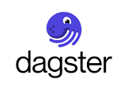
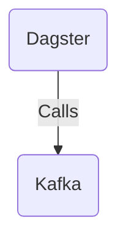

# Connect Kafka to Dagster

Quix helps you integrate Kafka to Dagster using pure Python.

<a class="md-button md-button--primary" href="https://share.hsforms.com/1iW0TmZzKQMChk0lxd_tGiw4yjw2?__hstc=175542013.2303933fbd746c0ac86d9ccbe9bc9100.1728383268831.1729603416735.1729620918855.31&__hssc=175542013.1.1729620918855&__hsfp=2132701734" target="_blank" style="margin-right:.5rem;">Book a demo</a>
 

## Dagster

Dagster is a data orchestrator that helps companies build, schedule, and monitor complex data pipelines. It allows users to define their pipelines using a programming interface and then execute them within a distributed computing environment. Dagster provides a unified view for managing dependencies between tasks, tracking data quality, and monitoring pipeline performance. With its modular architecture, Dagster is flexible and extensible, allowing users to easily integrate with various data sources and tools. Overall, Dagster simplifies the process of developing and managing data pipelines, making it an invaluable tool for organizations working with large amounts of data.

## Integrations

Quix is a good fit for integrating with Dagster because both platforms are focused on streamlining the development, deployment, and management of data pipelines. Quix Cloud's features such as streamlined development and deployment, enhanced collaboration, real-time monitoring, and flexible scaling align well with Dagster's goal of providing a unified platform for building data applications.

Additionally, Quix Streams, a cloud-native library for processing data in Kafka using Python, can easily integrate with Dagster's Python-based ecosystem. The serialization and state management capabilities of Quix Streams can complement Dagster's data pipeline architecture, while the time window aggregations and resilient scaling features can provide additional functionality for users working with real-time data processing.

Overall, the combination of Quix and Dagster can offer a comprehensive solution for developing and managing real-time data pipelines, providing users with a powerful platform for building and scaling data applications efficiently.

