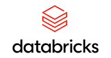
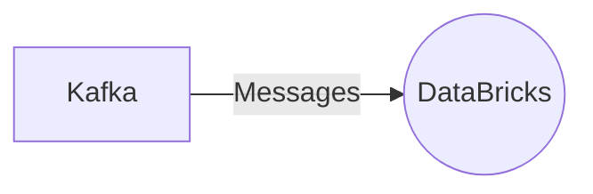

# Connect Kafka to DataBricks

Quix helps you integrate Kafka to DataBricks using pure Python.

<a class="md-button md-button--primary" href="https://share.hsforms.com/1iW0TmZzKQMChk0lxd_tGiw4yjw2?__hstc=175542013.2303933fbd746c0ac86d9ccbe9bc9100.1728383268831.1729603416735.1729620918855.31&__hssc=175542013.1.1729620918855&__hsfp=2132701734" target="_blank" style="margin-right:.5rem;">Book a demo</a>
 

## DataBricks

DataBricks is a powerful technology platform that enhances big data processing and analytics capabilities. It offers a unified analytics platform that brings together data engineering, data science, and machine learning in one collaborative workspace. DataBricks simplifies the process of building and deploying complex data pipelines and allows organizations to scale their data infrastructure seamlessly. With its integrated tools and Apache Spark-based processing engine, DataBricks enables users to analyze large datasets quickly and efficiently. Its automated features and interactive visualizations make it easy for data professionals to derive valuable insights from their data. Overall, DataBricks is a comprehensive solution for companies looking to streamline their data operations and drive data-driven decision-making.

## Integrations

Quix is a good fit for integrating with DataBricks because it offers a range of features that align well with the needs of data processing and analytics on the DataBricks platform. 

1. Streamlined Development and Deployment: Quix's integrated online code editors and CI/CD tools simplify the creation and deployment of data pipelines, making it easy to develop and deploy code on DataBricks.

2. Enhanced Collaboration: Quix supports efficient collaboration through organization and permission management, increasing project visibility and control, which is essential for teamwork on a platform like DataBricks.

3. Real-Time Monitoring: Quix Cloud provides tools for real-time logs, metrics, and data exploration, allowing users to monitor pipeline performance and critical metrics, which is crucial for monitoring data processing activities on DataBricks.

4. Flexible Scaling and Management: Quix allows users to easily scale resources, manage CPU and memory, and handle multiple environments linked to Git branches, aligning well with the scalability and resource management capabilities of DataBricks.

5. Security and Compliance: Quix ensures secure management of secrets and compliance with dedicated infrastructure options and SLAs, which is important for ensuring data security and compliance on the DataBricks platform.

6. Development Tools: Quix includes online code editors, code templates, and connectors for various data sources and sinks, supporting DevContainers for enhanced workflows, making it easier to develop and deploy data pipelines on DataBricks.

7. Data Exploration and Visualization: Quix enables users to query and explore data using waveform and table views, and visualize messages and metrics in real-time, making it easier to analyze and visualize data on DataBricks.

8. Robust CI/CD Processes: Quix's integration with Git providers like GitHub and Bitbucket facilitates seamless CI/CD processes, aligning well with the development workflows on DataBricks.

9. Kafka Integration: Quix Cloud supports both Quix-hosted and third-party Kafka solutions, including Confluent Cloud and Redpanda, enabling seamless integration with Kafka data streams on the DataBricks platform.

In addition, Quix Streams, a cloud-native library for processing data in Kafka using Python, can further enhance the capabilities of DataBricks by providing scalability, Python ecosystem integration, serialization and state management, time window aggregations, resilient scaling, and local and Jupyter Notebook support for data processing and analytics tasks. Overall, Quix's features and capabilities make it a good fit for integrating with DataBricks to streamline development, enhance collaboration, and provide real-time monitoring and scaling capabilities for data processing and analytics workflows.

