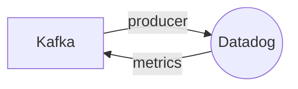

# Connect Kafka to Datadog

Quix helps you integrate Kafka to Datadog using pure Python.

## Datadog

Datadog is a cloud-based application monitoring service that provides organizations with real-time visibility into their entire technology stack. This platform seamlessly integrates with a wide range of infrastructure and software tools, allowing users to monitor their applications, databases, servers, and networks from a single interface. With Datadog, users can quickly identify and troubleshoot performance issues, set up custom alerts and notifications, and analyze trends and patterns in their data. Datadog also offers robust reporting and visualization capabilities, making it easy for teams to track and optimize the performance of their systems. Overall, Datadog is a powerful tool that helps businesses ensure the reliability and efficiency of their digital operations.

## Integrations

Quix is a good fit for integrating with Datadog because both platforms offer robust monitoring and scaling capabilities that are essential for managing real-time data pipelines. Datadog specializes in monitoring and analytics, providing visibility into the performance of applications and infrastructure. By integrating with Quix, users can leverage Datadog's monitoring tools to track the performance of their data pipelines in real-time.

Quix Streams' support for Kafka integration also aligns well with Datadog, as Kafka is a commonly used technology for building real-time streaming applications. Users can leverage Datadog's monitoring capabilities to keep track of Kafka cluster health, throughput, and latency, ensuring that their pipelines are running smoothly.

Additionally, Quix Streams' support for scalable container orchestration platforms like Kubernetes complements Datadog's ability to monitor containerized environments effectively. By integrating Quix Streams with Datadog, users can easily monitor the performance of their data pipelines running on Kubernetes clusters, and scale resources as needed based on Datadog's insights.

Overall, the combination of Quix with Datadog provides a comprehensive solution for developing, deploying, and monitoring real-time data pipelines, enhancing visibility, control, and scalability for users.

