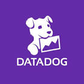

# Connect Kafka to Datadog



Quix helps you integrate Kafka to Datadog using pure Python.

<div>
<a class="md-button md-button--primary" href="https://share.hsforms.com/1iW0TmZzKQMChk0lxd_tGiw4yjw2?__hstc=175542013.2303933fbd746c0ac86d9ccbe9bc9100.1728383268831.1729603416735.1729620918855.31&__hssc=175542013.1.1729620918855&__hsfp=2132701734" target="_blank" style="margin-right:.5rem;">Book a demo</a>
<br/>
</div>

```mermaid
graph LR
A[Kafka] -- Logs and metrics -->|Datadog|
```

## Datadog

Datadog is a monitoring and analytics platform that helps organizations gain insights into their infrastructure and applications. It provides real-time visibility into the performance of an organization's systems, allowing teams to troubleshoot issues quickly and make data-driven decisions. Datadog collects and aggregates data from a variety of sources, including servers, databases, and cloud services, and presents it in a unified dashboard for easy access and analysis. With features like alerts, visualizations, and integrations with popular tools, Datadog helps teams optimize their systems, improve efficiency, and deliver a better user experience.

## Integrations

Quix is a good fit for integrating with Datadog because it provides a robust platform for developing, deploying, and managing real-time data pipelines. With its streamlined development and deployment features, Quix makes it easy to create and deploy data pipelines efficiently. This aligns well with Datadog's emphasis on monitoring and analyzing real-time data.

Additionally, Quix's real-time monitoring capabilities are in sync with Datadog's emphasis on real-time logs, metrics, and data exploration. This allows users to easily monitor pipeline performance and critical metrics, providing valuable insights into the health and performance of the data pipelines.

Furthermore, Quix's support for flexible scaling and management, as well as security and compliance measures, ensures that data pipelines can be efficiently managed and secured. This complements Datadog's focus on providing a secure and scalable platform for monitoring and managing data.

Quix's integration with Git providers like GitHub and Bitbucket also aligns well with Datadog's emphasis on seamless CI/CD processes, enabling developers to easily synchronize code changes and deploy pipelines efficiently.

Overall, the features and capabilities of Quix, such as its support for Kafka integration, dedicated infrastructure options, and Python ecosystem integration through Quix Streams, make it a strong fit for integrating with Datadog to enhance monitoring, management, and scaling of real-time data pipelines.

