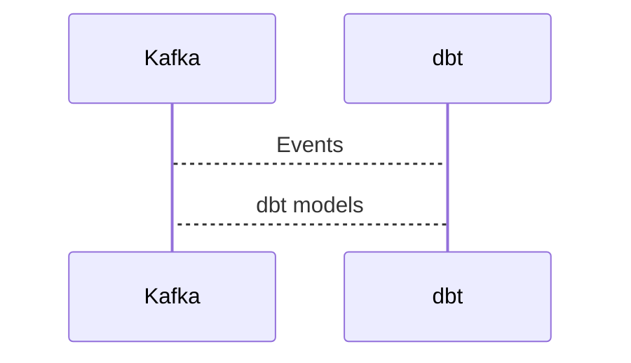

# Connect Kafka to dbt

Quix helps you integrate Kafka to dbt using pure Python.

## dbt

dbt, or Data Build Tool, is an open-source command line tool that simplifies the process of transforming and modeling data within a data warehouse. dbt allows data analysts and engineers to easily write and run SQL queries to extract, transform, and load data into their data warehouse. dbt also provides a way to document data transformations and manage dependencies between different data models, making it easier for teams to collaborate on complex data projects. With dbt, users can easily test and document their data transformations, ensuring that data quality is maintained throughout the data modeling process.

## Integrations

Quix is a good fit for integrating with dbt because it offers a comprehensive platform for developing, deploying, and managing real-time data pipelines. Dbt is a data transformation tool that allows for the creation of data models in a SQL-based language, and easily integrates with data warehouses to transform and analyze data.

The key components of Quix Cloud, such as streamlined development and deployment, enhanced collaboration, real-time monitoring, and flexible scaling capabilities, align well with the needs of dbt users. Quix Cloud's support for development tools, data exploration and visualization, robust CI/CD processes, Kafka integration, and dedicated/BYOC options also add value to the integration with dbt.

Additionally, Quix Streams provides a cloud-native library for processing data in Kafka using Python, which complements the Python ecosystem integration of dbt. With features like serialization and state management, time window aggregations, resilient scaling, and support for local and Jupyter Notebook development, Quix Streams can enhance the capabilities of dbt users when working with real-time data pipelines.

Overall, the combination of Quix with dbt provides a powerful and efficient solution for developing, deploying, and managing data pipelines, making it a good fit for organizations looking to streamline their data transformation processes.

