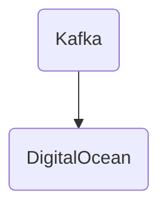

# Connect Kafka to DigitalOcean

Quix helps you integrate Kafka to DigitalOcean using pure Python.

## DigitalOcean

DigitalOcean is a cloud infrastructure provider that offers a range of services to help businesses deploy, manage, and scale their applications and websites. The platform provides virtual servers, storage solutions, and networking capabilities that can be easily configured and managed through an intuitive control panel. DigitalOcean is known for its simplicity and developer-friendly tools, making it a popular choice for startups and small to medium-sized businesses looking to leverage the power of the cloud. With data centers located around the world, DigitalOcean provides reliable and high-performance infrastructure that can easily be customized to meet the specific needs of each customer.

## Integrations

Quix is a good fit for integrating with DigitalOcean because it offers a comprehensive platform for developing, deploying, and managing real-time data pipelines. DigitalOcean provides a reliable and scalable infrastructure for hosting applications, making it an ideal partner for running the data pipelines created using Quix.

One of the key features of Quix Streams is its seamless integration with Kafka, a popular distributed streaming platform. DigitalOcean offers support for hosting Kafka clusters, which makes it easy to deploy and manage Kafka-based data pipelines using Quix Streams.

Additionally, Quix Streams is built using Python, which aligns well with DigitalOcean's focus on supporting a wide range of programming languages and frameworks. This integration allows users to take advantage of DigitalOcean's infrastructure while leveraging Quix Streams' user-friendly Python interface for processing data.

Furthermore, the monitoring and scaling capabilities of Quix Cloud complement DigitalOcean's robust infrastructure management tools, allowing users to easily monitor pipeline performance and scale resources as needed.

Overall, the combination of Quix with DigitalOcean provides a powerful solution for developing, deploying, and managing real-time data pipelines in the cloud.

