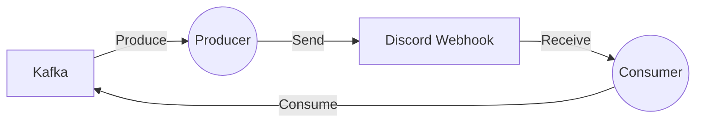

# Connect Kafka to Discord

Quix helps you integrate Kafka to Discord using pure Python.

## Discord

Discord is a popular communication platform that was originally designed for gamers but has since expanded to cater to a wider audience. It allows users to chat with each other in real-time through text, voice, and video calls. Users can create their own servers or join existing ones to connect with friends, family, or like-minded individuals. The platform also offers the ability to share multimedia files, stream games, and integrate with other apps and services. With customizable features, moderation tools, and a strong community, Discord has become a versatile and user-friendly technology for staying connected in a digital world.

## Integrations

Integrating Quix with Discord can provide several benefits for users looking to enhance their data processing and collaboration capabilities. Discord is a popular platform for communication among teams, particularly in the gaming and tech industries. By integrating Quix with Discord, users can leverage the following advantages:

1. Real-time Notifications: Discord can be used to receive real-time notifications and alerts from Quix, keeping users informed about the status of data pipelines, monitoring metrics, and any critical issues that may arise.

2. Collaboration and Communication: Discord's chat-based interface allows for seamless communication and collaboration among team members working on data pipelines. Users can discuss project updates, share insights, and troubleshoot issues in real-time.

3. Enhanced Visibility: By integrating Quix with Discord, users can increase project visibility and awareness among team members. Discord channels can be set up to display key metrics, logs, and pipeline statuses, making it easier for all team members to stay informed.

4. Workflow Efficiency: Discord integration can streamline workflow processes by enabling automated notifications and alerts based on specific triggers within Quix. This can help teams respond quickly to issues and make timely decisions to keep data pipelines running smoothly.

5. Cross-Platform Support: Discord is accessible on multiple devices and platforms, making it easy for users to stay connected and engaged with their data pipeline projects, whether they are in the office or on the go.

Overall, integrating Quix with Discord can improve collaboration, communication, and workflow efficiency for teams working on real-time data processing projects. The combination of Quix's powerful data processing capabilities with Discord's communication features can help teams maximize their productivity and project success.

