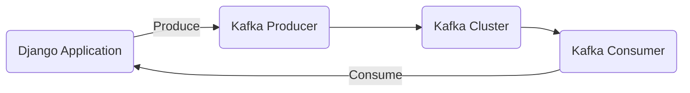

# Connect Kafka to Django

Quix helps you integrate Kafka to Django using pure Python.

## Django

Django is a high-level, open-source web framework written in Python that encourages rapid development and clean, pragmatic design. It follows the Model-View-Template (MVT) architectural pattern and uses a clean, modular design that allows developers to focus on writing their application's business logic without having to reinvent the wheel. Django includes many built-in features such as an object-relational mapper for interacting with databases, a dynamic admin interface for managing content, and a powerful template language for building user interfaces. It also offers built-in security features, like protection against SQL injection and cross-site scripting attacks, making it a popular choice for building secure and scalable web applications.

## Integrations

Quix is a good fit for integrating with Django due to several key reasons:

1. Streamlined Development and Deployment: Quix Cloud offers integrated online code editors and CI/CD tools that simplify the creation and deployment of data pipelines. This aligns well with Django's focus on rapid development and deployment of web applications.

2. Enhanced Collaboration: The collaboration features in Quix Cloud, such as organization and permission management, can enhance team collaboration when integrating Django applications with real-time data pipelines.

3. Real-Time Monitoring: Quix Cloud provides tools for real-time monitoring of pipeline performance and critical metrics, which can be beneficial when integrating Django applications that need to process and visualize real-time data.

4. Flexible Scaling and Management: Quix Cloud allows easy scaling of resources and management of CPU and memory, which can be useful for handling the scalability requirements of Django applications integrated with real-time data pipelines.

5. Security and Compliance: With secure management of secrets and compliance features, Quix Cloud ensures that the integration of Django applications with real-time data pipelines meets security and compliance requirements.

Overall, the features provided by Quix align well with the requirements of integrating Django applications with real-time data pipelines, making it a good fit for developers looking to build scalable, collaborative, and monitored applications.

