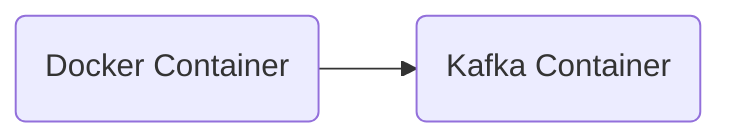

# Connect Kafka to Docker

Quix helps you integrate Kafka to Docker using pure Python.

## Docker

Docker is a popular containerization technology that allows developers to package and deploy applications in a consistent, portable, and efficient way. Containers are lightweight, standalone, and executable software packages that include everything needed to run an application, such as code, runtime, system tools, libraries, and settings. Docker helps streamline the development and deployment processes by isolating applications from their underlying environment, making it easier to move them between different environments and ensure consistent behavior across different platforms. With Docker, developers can build, test, and deploy applications quickly and efficiently, resulting in faster delivery times and increased productivity.

## Integrations

Quix Streams, with its cloud-native architecture and Python interface, aligns well with the containerization technology offered by Docker. Docker's containerization capabilities make it easy to package and deploy applications, including data pipelines, in a consistent and isolated environment. By integrating Quix Streams with Docker, developers can take advantage of the following benefits:

1. Portability: Docker containers encapsulate the necessary dependencies and configurations for running Quix Streams, making it easy to run the application on different environments without worrying about compatibility issues.

2. Scalability: Docker's container orchestration platforms, such as Kubernetes, provide resilient scaling capabilities for managing Quix Streams instances across multiple nodes. This ensures that the application can handle varying workloads and scale up or down based on demand.

3. Resource Efficiency: Docker containers are lightweight and resource-efficient, enabling developers to run multiple instances of Quix Streams on a single host machine without impacting performance.

4. Easy Development and Debugging: Developers can leverage Docker's support for local development environments and tools like Jupyter Notebooks to streamline the development and debugging process for Quix Streams applications.

Overall, by integrating Quix Streams with Docker, developers can enhance the agility, scalability, and efficiency of their data processing workflows while leveraging the rich feature set offered by both technologies.

