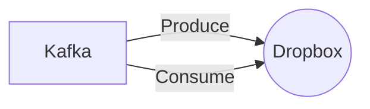

# Connect Kafka to Dropbox

Quix helps you integrate Kafka to Dropbox using pure Python.

<a class="md-button md-button--primary" href="https://share.hsforms.com/1iW0TmZzKQMChk0lxd_tGiw4yjw2?__hstc=175542013.2303933fbd746c0ac86d9ccbe9bc9100.1728383268831.1729603416735.1729620918855.31&__hssc=175542013.1.1729620918855&__hsfp=2132701734" target="_blank" style="margin-right:.5rem;">Book a demo</a>
 

## Dropbox

Dropbox is a cloud-based technology that allows users to store and share files, photos, and videos online. Users can upload their files to the Dropbox platform and access them from any device with an internet connection. Dropbox offers various storage plans, allowing users to choose the amount of storage space that best fits their needs. Dropbox also offers features such as file syncing, which automatically updates files across all devices, and file sharing, which allows users to easily share files with others by generating a link. This technology is popular among individuals and businesses for its ease of use and ability to streamline file management and collaboration.

## Integrations

Quix is a good fit for integrating with Dropbox because of its robust development and deployment features. With integrated online code editors and CI/CD tools, developers can easily create and deploy data pipelines, making it seamless to work with Dropbox APIs and functionalities. Quix's YAML synchronization allows for defining pipelines and environment variables as code, ensuring easy management and maintenance of pipelines.

Additionally, Quix's real-time monitoring capabilities align well with Dropbox's need for efficient data processing and performance tracking. Users can monitor pipeline performance, critical metrics, and logs in real-time, ensuring smooth operations and timely insights.

Furthermore, Quix's flexibility in scaling and management makes it an ideal platform for integrating with Dropbox. Users can easily scale resources, manage CPU and memory, and handle multiple environments linked to Git branches, providing the agility and resource management needed for seamless integration with Dropbox.

Overall, Quix's streamlined development, enhanced collaboration, real-time monitoring, and flexible scaling capabilities make it a strong candidate for integrating with Dropbox, enabling efficient data processing and streamlined workflows for developers.

