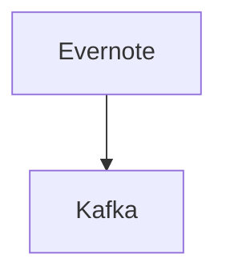

# Connect Kafka to Evernote

Quix helps you integrate Kafka to Evernote using pure Python.

## Evernote

Evernote is a versatile and highly popular note-taking application that allows users to organize and store all their thoughts, ideas, and important information in one easily accessible place. With features like notebooks, tags, and search capabilities, users can keep track of their notes in a way that makes sense to them. Evernote also offers the ability to sync across multiple devices, ensuring that users can access their notes wherever they are. The software supports a wide range of file types including text, images, audio recordings, and even PDFs, making it a versatile tool for storing all kinds of information. Overall, Evernote is a powerful and user-friendly technology that helps individuals stay organized and productive in both their personal and professional lives.

## Integrations

Quix is a good fit for integrating with Evernote because of its comprehensive platform designed for developing, deploying, and managing real-time data pipelines. Evernote, as a note-taking application, generates a large amount of data that needs to be processed and managed in real-time. Quix Cloud offers streamlined development and deployment tools, enhancing collaboration and providing real-time monitoring and scaling capabilities.

With Evernote generating a significant amount of data, Quix Cloud's real-time monitoring tools would be essential for tracking pipeline performance and critical metrics. The platform's flexible scaling and management capabilities would also allow for efficient resource allocation and management of CPU and memory, ensuring that Evernote's data processing needs are met effectively.

Additionally, Quix Cloud's integration with GitHub and other Git providers simplifies the CI/CD processes, enabling seamless deployment and continuous integration. The platform's support for Kafka integration would also be beneficial for processing data streams efficiently.

Moreover, Quix Streams' cloud-native library for processing data in Kafka using Python would be particularly useful for integrating with Evernote's data streams. The ability to work with Python seamlessly and support serialization formats and stateful operations would streamline the processing of Evernote's data within Kafka.

In conclusion, Quix would be a good fit for integrating with Evernote due to its comprehensive features that cater to real-time data processing, monitoring, and scalability needs. The platform's support for Python integration, Kafka processing, and CI/CD processes make it well-suited for handling the data generated by Evernote effectively.

