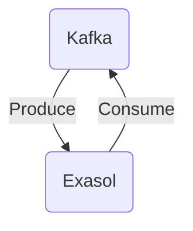

# Connect Kafka to Exasol

Quix helps you integrate Kafka to Exasol using pure Python.

## Exasol

Exasol is a high-performance analytics database that is designed for organizations dealing with large amounts of data. It is known for its speed and efficiency in processing complex queries and performing real-time data analyses. Exasol utilizes in-memory processing and parallel computing techniques to achieve extremely fast query response times, making it ideal for businesses that require quick access to insights from their data. Its ability to scale easily and handle petabytes of data makes it a popular choice for data-driven companies looking to unlock the full potential of their data. Additionally, Exasol offers seamless integration with popular business intelligence tools and data visualization platforms, allowing users to easily derive actionable insights from their data.

## Integrations

Quix would be a good fit for integrating with Exasol because they offer seamless integration with Kafka, which is a commonly used streaming platform for real-time data processing. Exasol, on the other hand, is a high-performance analytics database that can handle massive amounts of data with speed and efficiency. By integrating Quix with Exasol, users can leverage the scalability and real-time processing capabilities of Kafka with the fast and powerful analytics capabilities of Exasol.

Additionally, Quix Streams and Quix Cloud offer features such as flexible scaling, real-time monitoring, and enhanced collaboration, which are essential for managing and optimizing data pipelines in a fast-paced and dynamic environment. With Quix Streams' support for time window aggregations, serialization, and state management, users can easily process and analyze streaming data from Kafka before loading it into Exasol for further analysis.

Furthermore, the platform's CI/CD processes and dedicated/BYOC options ensure secure and compliant deployment of data pipelines, making it easier for organizations to manage their data workflows efficiently. Overall, integrating Quix with Exasol would provide a comprehensive and streamlined solution for real-time data processing and analytics, enabling organizations to make informed decisions based on up-to-date and accurate data.

