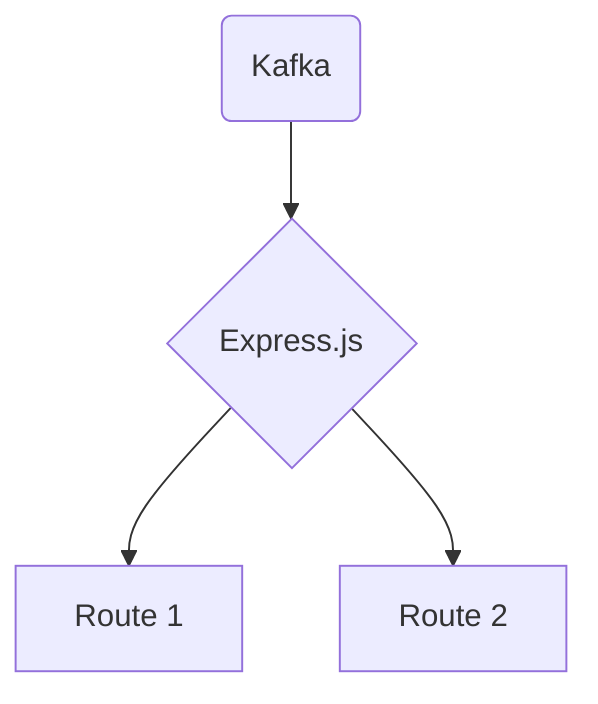

# Connect Kafka to Express.js

Quix helps you integrate Kafka to Express.js using pure Python.

## Express.js

Express.js is a popular and lightweight web application framework for Node.js. It simplifies the process of building web applications by providing a robust set of features, including routing, middleware, and templating. Express.js is known for its flexibility and scalability, allowing developers to create both simple APIs and complex, full-featured web applications. Its minimalist design and easy-to-use syntax make it a favorite among developers who value efficiency and speed in their projects. Additionally, Express.js has a large and active community, ensuring that developers have access to plenty of resources and support when working with the framework.

## Integrations

Express.js is a popular web framework for Node.js that is known for its simplicity and flexibility. It is often used to build APIs and web applications, making it an ideal technology to integrate with Quix for real-time data processing and analytics.

Quix Streams, being a cloud-native library for processing data in Kafka using Python, offers a seamless integration with Express.js through its Python interface. This allows developers to leverage the scalability of Kafka and the user-friendly interface of Python in combination with the simplicity and flexibility of Express.js.

By using Quix with Express.js, developers can benefit from a streamlined development and deployment process, enhanced collaboration tools, real-time monitoring and scaling capabilities, as well as robust CI/CD processes. The flexibility of Quix Streams in supporting serialization formats, time window aggregations, and container orchestration aligns well with the capabilities and requirements of Express.js for building APIs and web applications.

Overall, integrating Quix with Express.js provides developers with a powerful and efficient solution for processing real-time data and building applications that require scalability, flexibility, and reliability.

