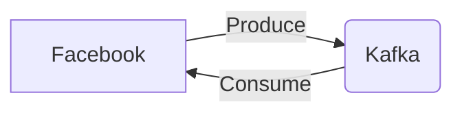

# Connect Kafka to Facebook

Quix helps you integrate Kafka to Facebook using pure Python.

## Facebook

Facebook is a social media platform that allows users to connect with friends and family members, share updates and photos, and discover new content from pages and groups they follow. Founded by Mark Zuckerberg in 2004, Facebook has grown to become one of the largest social media networks in the world, with over 2.8 billion active users. The platform offers a range of features, including news feeds, messaging, events, and marketplace, making it a versatile tool for communication and networking. With its user-friendly interface and robust privacy settings, Facebook has become a popular way for people to stay connected and informed in the digital age.

## Integrations

Integrating Quix with Facebook can provide several benefits for organizations looking to leverage real-time data pipelines and processing capabilities within their Facebook applications or services.

1. Seamless integration with Python: Both Quix Streams and Quix Cloud support Python as a primary programming language for building and managing data pipelines. Facebook developers who are already familiar with Python can easily use these platforms to process and analyze data from Facebook applications without the need to learn a new programming language or tool.

2. Real-time monitoring and scaling capabilities: Quix Cloud offers real-time monitoring and scaling capabilities, allowing developers to monitor pipeline performance, track critical metrics, and scale resources as needed. This can be particularly beneficial for handling large volumes of data generated by Facebook applications and ensuring consistent performance without interruptions.

3. Enhanced collaboration and project visibility: Quix Cloud provides tools for efficient collaboration, organization, and permission management, increasing project visibility and control. This can improve collaboration among Facebook developers working on data processing tasks, ensuring that everyone has access to the necessary resources and can contribute effectively to the development process.

4. Security and compliance features: Quix Cloud offers secure management of secrets and compliance with dedicated infrastructure options and service level agreements (SLAs). This can help ensure that sensitive data from Facebook applications is protected and that any compliance requirements are met, reducing the risk of data breaches or unauthorized access.

5. Data exploration and visualization capabilities: Both Quix Streams and Quix Cloud provide tools for querying, exploring, and visualizing data in real-time. This can help Facebook developers gain valuable insights from the data generated by their applications, enabling them to make informed decisions and optimize performance based on real-time metrics and observations.

Overall, integrating Quix with Facebook can streamline data processing tasks, enhance collaboration, provide real-time monitoring and scaling capabilities, and ensure security and compliance with data handling practices. This can ultimately help organizations make the most of the data generated by Facebook applications and improve overall performance and user experience.

