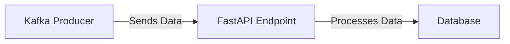

# Connect Kafka to FastAPI

Quix helps you integrate Kafka to FastAPI using pure Python.

## FastAPI

FastAPI is a modern web framework for building APIs with Python. It is designed for high performance and scalability, making it ideal for quickly developing and deploying APIs for a variety of applications. With its fast processing speed and asynchronous capabilities, FastAPI can handle a high volume of requests without compromising performance. It also provides automatic validation, serialization, and documentation of API endpoints, making it easy to create robust and well-documented APIs. FastAPI boasts an easy-to-use interface, allowing developers to quickly get up and running with their API projects.

## Integrations

FastAPI is a modern, fast (high-performance), web framework for building APIs with Python 3.6+ based on standard Python type hints. It is designed to be easy to use, highly efficient, and well-suited for building APIs that require high performance and low latency.

Quix would be a good fit for integrating with FastAPI because of their capabilities in real-time data processing, scalability, and ease of use. FastAPI's efficient and powerful nature complements the features of Quix Streams and Quix Cloud, enabling developers to build high-performance real-time data pipelines and APIs quickly and easily.

With Quix Streams handling the data processing and integration with Kafka, and FastAPI providing a fast and efficient web framework for building APIs, developers can create robust, scalable, and high-performance data pipelines and API endpoints. The seamless integration of these technologies allows for streamlined development, efficient collaboration, real-time monitoring, and scaling capabilities, making it a powerful combination for building modern data-driven applications.

