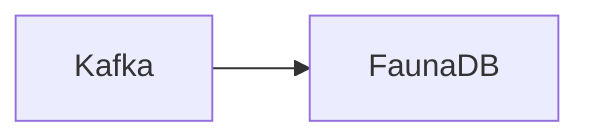

# Connect Kafka to FaunaDB

Quix helps you integrate Kafka to FaunaDB using pure Python.

## FaunaDB

FaunaDB is a cutting-edge, globally-distributed serverless database that allows developers to build modern applications with ease. It offers a flexible data model that can handle complex data structures and relationships, making it ideal for applications that require real-time data processing and scalability. FaunaDB boasts a strong consistency model, ensuring data integrity and reliability across distributed environments. Its built-in security features, including end-to-end encryption and access control mechanisms, make it a secure choice for storing sensitive information. With its pay-as-you-go pricing model and support for popular programming languages, FaunaDB is a powerful tool for developers looking to create fast and reliable applications.

## Integrations

FaunaDB is a distributed database that offers a serverless, globally distributed data platform for modern applications. Its key features include flexible data modeling, real-time data synchronization, and built-in security. 

Quix would be a good fit for integrating with FaunaDB due to the following reasons:

1. Real-Time Data Processing: Quix Streams allows for processing data in real-time using Python, which complements FaunaDB's real-time data synchronization capabilities. This integration can enable real-time analytics, monitoring, and decision-making based on the latest data.

2. Scalability: Quix Streams is designed to be resilient and scalable via container orchestration, while FaunaDB offers global distribution and automatic scaling without the need for manual sharding. This makes it easier to handle growing data volumes and spikes in traffic while maintaining consistent performance.

3. Developer-Friendly Interface: Quix Streams provides a user-friendly Python interface for working with data in Kafka, making it easy for developers to write and debug data processing pipelines. FaunaDB's flexible data modeling and support for various serialization formats aligns well with this developer-friendly approach, enabling seamless integration and data transfer between the two technologies.

4. Security and Compliance: Both Quix Streams and FaunaDB prioritize security and compliance in their platforms. Quix Cloud offers secure management of secrets and compliance options, while FaunaDB provides built-in security features such as data encryption, role-based access control, and compliance certifications like GDPR and HIPAA. Integrating these technologies can ensure that data is processed and stored securely and in compliance with industry regulations.

Overall, the combination of Quix with FaunaDB can provide a powerful solution for building real-time data pipelines, processing data efficiently, and scaling applications to meet growing demands. This integration can help organizations leverage the strengths of both technologies to create robust, scalable, and secure data solutions for modern applications.

