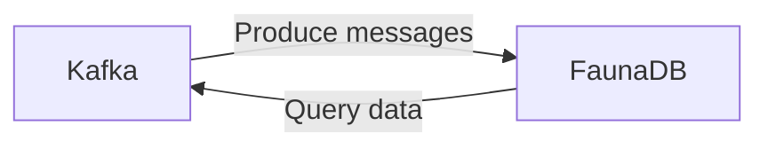

# Connect Kafka to FaunaDB

Quix helps you integrate Kafka to FaunaDB using pure Python.

- __Find out how we can help you integrate!__

    <a class="md-button md-button--primary" href="https://share.hsforms.com/1iW0TmZzKQMChk0lxd_tGiw4yjw2?__hstc=175542013.2303933fbd746c0ac86d9ccbe9bc9100.1728383268831.1729603416735.1729620918855.31&__hssc=175542013.1.1729620918855&__hsfp=2132701734" target="_blank" style="margin:.5rem;">Book a demo</a>

## FaunaDB

FaunaDB is a cloud-native, serverless, distributed database that is designed to offer fast, consistent, and scalable data storage for modern applications. It provides a schemaless data model that allows developers to store and query JSON documents with ease. FaunaDB also offers features like transaction support, fine-grained access control, and built-in data replication to ensure data integrity and availability. With its global distribution and built-in support for multi-region deployments, FaunaDB is ideal for applications that require high availability and low latency access to data. Additionally, FaunaDB's serverless architecture eliminates the need for manual scaling and maintenance, making it a cost-effective and user-friendly choice for developers.

## Integrations

FaunaDB is a scalable, serverless, globally-distributed database that provides strong consistency, built-in security, and ACID transactions. Quix is a good fit for integrating with FaunaDB because of its focus on real-time data pipelines and its support for seamless collaboration, monitoring, and scaling capabilities.

1. Real-Time Data Pipelines: Quix Cloud's streamlined development and deployment features make it easy to create and deploy data pipelines, which can seamlessly integrate with FaunaDB to process and store real-time data efficiently.

2. Enhanced Collaboration: Quix Cloud's support for organization and permission management enhances collaboration, making it easy for teams to work together on data pipeline projects that involve FaunaDB without compromising on security or governance.

3. Real-Time Monitoring: Quix Cloud's tools for real-time monitoring allow users to keep track of their data pipelines' performance and critical metrics, ensuring that data is processed and stored correctly in FaunaDB.

4. Flexible Scaling and Management: Quix Cloud's flexibility in scaling resources and handling multiple environments correlates well with FaunaDB's scalability and distributed nature, enabling seamless management of data pipelines that involve FaunaDB.

5. Security and Compliance: Quix Cloud ensures secure management of secrets and compliance with dedicated infrastructure options, aligning well with FaunaDB's built-in security features and ACID transactions that guarantee data integrity and reliability.

6. Development Tools: Quix Cloud's development tools and support for various data sources and sinks enhance the integration with FaunaDB, enabling users to efficiently process and store data in real-time using Quix Streams and FaunaDB.

In conclusion, Quix's focus on real-time data pipelines, collaboration, monitoring, scaling, and security makes it a great fit for integrating with FaunaDB to efficiently process and store real-time data with strong consistency, reliability, and security.

